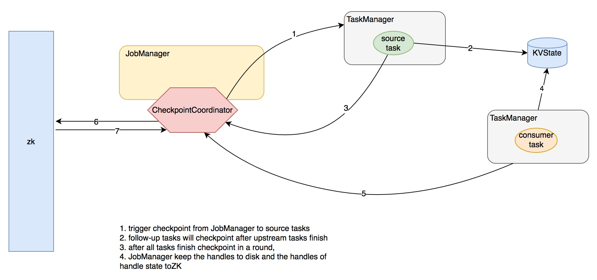
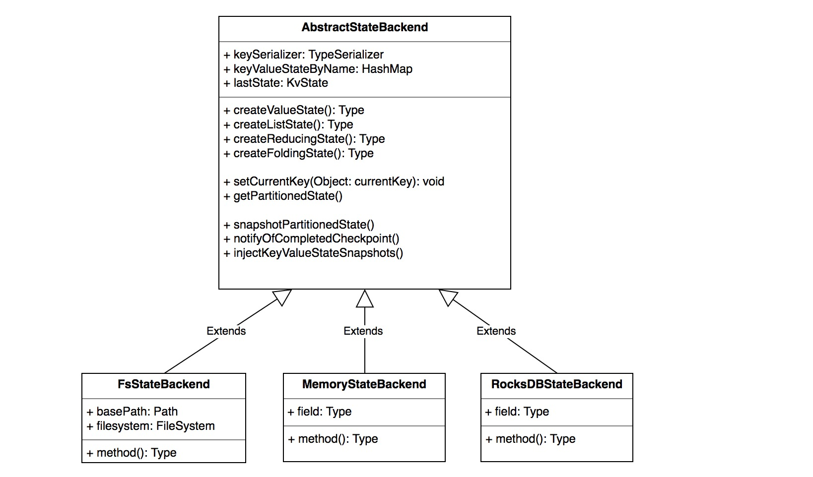
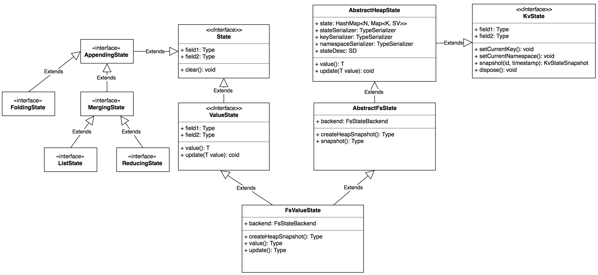
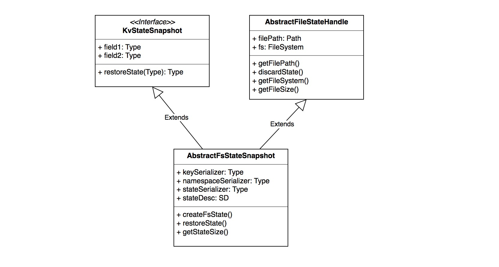

# Flink Watermark And Checkpoint

## 前言

在前面一章 flink 网络栈的讲解中，我们介绍了 Barrier 的改变以及 Barrier 在 InputGate 消费数据的过程中扮演的时间对齐作用，同时，我们介绍了 InputProcessor 负责数据读取，同时会追踪 watermark 时间并分发到下游。这里我们从 InputProcessor 开始讲起

为什么将 Watermark 和 Checkpoint 放在一起将，是因为它们在原理上有相似之处：上游节点逐级广播消息给下游节点来完成一次行为

## WaterMark

### WaterMark是什么

Watermark 是协调窗口计算的一种方式，它告诉了算子时间不大于 WaterMark 的消息不应该再被接收【如果出现意味着延迟到达】。WaterMark 从源算子开始 emit，并逐级向下游算子传递，算子需要依据自己的缓存策略在适当的时机将 WaterMark 传递到下游。当源算子关闭时，会发射一个携带 `Long.MAX_VALUE` 值时间戳的 WaterMark，下游算子接收到之后便知道不会再有消息到达。

Flink 提供三种消息时间特性：EventTime【消息产生的时间】、ProcessingTime【消息处理时间】 和 IngestionTime【消息流入 flink 框架的时间】，WaterMark 只在时间特性 EventTime 和 IngestionTime 起作用，并且 IngestionTime 的时间等同于消息的 ingestion 时间。

### WaterMark的协调与分发

对于 watermark 的协调与分发集中在 InputProcessor 的 processInput 方法中，下面我们来详细分析其逻辑：

```java
//StreamInputProcessor line134
public boolean processInput(OneInputStreamOperator<IN, ?> streamOperator, final Object lock) throws Exception {
		if (isFinished) {
			return false;
		}
		if (numRecordsIn == null) {
			numRecordsIn = streamOperator.getMetricGroup().counter("numRecordsIn");
		}

		while (true) {
			if (currentRecordDeserializer != null) {
				DeserializationResult result = currentRecordDeserializer.getNextRecord(deserializationDelegate);

				if (result.isBufferConsumed()) {
					currentRecordDeserializer.getCurrentBuffer().recycle();
					currentRecordDeserializer = null;
				}
```

总结其逻辑：

- 如果消费到的消息是一个 WaterMark，获得其对应的 source channel id 并将时间更新进去，同时记录下当前所有 channel 的最小 WaterMark 时间
- 如果当前最小 WaterMark 时间【所有的 channel 都至少消费到该时间】大于上次发射给下游的 WaterMark 时间，则更新 WaterMark 时间并将其交给算子处理
- 通常算子在处理【尤其是涉及了窗口计算或者需要时间缓存策略的算子】后会将 WaterMark 继续往下游广播发送

### WaterMark 的来源

上面我们提到 WaterMark 最初由源算子负责发射到下游，那么它的生成规则是什么呢？又是如何协调的？

*我们来看一个源算子的实现便知*

在第一章 flink 逻辑计划生成，我们了解了 flink 所有的源算子都继承自 SourceFunction 接口，SourceFuntion 定义了管理消息发射环境的接口 SourceContext，SourceContext 的具体实现在 StreamSource 中，一共有三种：NonTimestampContext、AutomaticWatermarkContext、ManualWatermarkContext，我们来逐一分析。

#### NonTimestampContext

适用于时间特性：TimeCharacteristic#ProcessingTime，顾名思义，不会 emit 任何 WaterMark

#### AutomaticWatermarkContext

自动发射 WaterMark，适用于 TimeCharacteristic#IngestionTime ，也就是源算子的处理时间。flink 起了一个timer task 专门以一定的 interval 间隔发射 WaterMark，一个 Interval 内所有 Record 的发射时间处于上次 emit 的 WaterMark 和下次将要 emit 的 WaterMark 之间，Interval 边界到达后会提升下一个 WaterMark 时间，计算本次的 WaterMark 时间并 emit 出去。

自动 emit watermark 的 interval 默认是 200ms ，这是写死不可配置的，具体见：

```java
//StreamExecutionEnvironment line598
public void setStreamTimeCharacteristic(TimeCharacteristic characteristic) {
		this.timeCharacteristic = Preconditions.checkNotNull(characteristic);
		if (characteristic == TimeCharacteristic.ProcessingTime) {
			getConfig().setAutoWatermarkInterval(0);
		} else {
			getConfig().setAutoWatermarkInterval(200);
		}
	}
```


#### ManualWatermarkContext

用户自己指定 WaterMark 时间，使用于 TimeCharacteristic#EventTime，用户需要提供依据源消息提取 Watermark 时间的工具 function

*那么用户有哪些指定时间的逻辑呢？*

##### TimestampAssigner

flink 通过接口 TimestampAssigner 来让用户依据消息的格式自己抽取可能被用于 WaterMark 的 timestamp，它只定义了一个接口：`long extractTimestamp(T element, long previousElementTimestamp);`

而 TimestampAssigner 的两个继承接口 AssignerWithPunctuatedWatermarks 以及 AssignerWithPeriodicWatermarks 定义了另种典型的时间戳生成规则：

- AssignerWithPunctuatedWatermarks：依据消息中事件元素及自带 timestamp 来驱动 watermark 的递增
- AssignerWithPeriodicWatermarks：依据消息中的 timestamp 周期性地驱动 watermark 的递增

各个场景可以依据业务的需求去继承和实现

## Checkpoint

CheckPoint 是 flink 保证消息不丢的机制，通过 Barrier 的方式来协调时机，那么什么是 Barrier 呢？

其实前一章介绍 flink 网络栈 的时候已经有介绍在消费端 flink 对于不同的 Barrier 处理，实际上，Barrier 是用来校准 checkpint 的方式。由于对于一个拓扑结构，只有上游算子 checkpoint 完，下游算子的 cehckpoint 才能开始并有意义，同时下游算子的消费速率并不统一【有的 channel 快，有的 channel 慢】，而 Barrier 就是这样一种协调上下游算子的机制。

JobManager 统一通知源算子发射 Barrier 事件，并向下游广播，当下游算子收到这样的事件后，它就知道自己处于两次 checkpoint 之间【一次新的 checkpoint 将被发起】

当下游算子收到了它所有的 InputChannel 的 Barrier 事件后，它便知道上游算子的一次 checkpoint 已完成，自己也可以做 checkpoint 了，完成之后继续将 checkpoint 事件广播到下游算子

在 Exact-once 语义下，消费端会延迟消费并校准不同 channel 的消费速率，这在 flink 网络栈一章有详细介绍！

### Checkpoint 的协调与发起

前面提到过 checkpoint 统一由 JobManager 发起，我们来看相关逻辑：

#### CheckpointCoordinator

flink 的 checkpoint 统一由 CheckpointCoordinator 来协调，通过将 checkpoint 命令事件发送给相关的 tasks 【源 tasks】，它发起 checkpoint 并且收集 checkpoint 的 ack 消息。

##### 构造参数

这里有必要了解一些关键参数，以便我们更加了解 Checkpoint 的细节策略

- baseInternal：快照的间隔
- checkpointTimeout：一次 checkpoint 的超时时间，超时的 checkpoint 会被取消
- maxConcurrentCheckpointAttempts：最多可同时存在的 checkpoint 任务，是对于整个 flink job
- tasksToTrigger：触发分布式 Checkpoint 的起始 tasks，也就是 source tasks

##### Checkpoint的发起

前面的章节我们介绍过 ExecutionGraph【flink物理计划抽象】，它有一个核心接口 `enableSnapshotCheckpointing` ，这个接口在 JobManager 提交作业的时候被执行，具体见`JobManager line1238 from method submitJob`。这个接口的逻辑总结如下：

- 获取 checkpoint 的发起节点【源节点】，需要 ack 和 commit 的节点【所有节点】
- 先关闭已有 checkpoint
- 实例化 CheckpointCoordinator 和它的监听 Akka 系统 CheckpointCoordinatorDeActivator，并将 CheckpointCoordinatorDeActivator 注册为 EecutionGraph 的 listener，当作业的执行状态变为 RUNNING 时，会通知 CheckpointCoordinatorDeActivator 启动 CheckpointCoordinator 的 checkpoint 线程

*那么 CheckpointCoordinator 在收到这样的消息后会怎么处理呢？*

它会发起一个 timer task，定时执行，并且传入的时间为当前的系统时间，由于 CheckpointCoordinator 全局只有一个，这个时间也是全局递增并且唯一的：

```java
//CheckpointCoordinator line 1020
private class ScheduledTrigger extends TimerTask {

		@Override
		public void run() {
			try {
				triggerCheckpoint(System.currentTimeMillis());
			}
			catch (Exception e) {
				LOG.error("Exception while triggering checkpoint", e);
			}
		}
	}
```

*下面我们来具体分析 checkpoint 的一些核心动作*

###### checkpoint 的触发

```java
//CheckpointCoordinator line389
public boolean triggerCheckpoint(long timestamp, long nextCheckpointId) throws Exception {
		// make some eager pre-checks
		synchronized (lock) {
			// abort if the coordinator has been shutdown in the meantime
			if (shutdown) {
				return false;
			}
//...
```

总结逻辑：

- 如果已关闭或优先处理排队请求会总额并发任务超过限制，都会取消此次 checkpoint 的发起
- 如果最小间隔时间未达到，也会取消此次 checkpoint
- check 所有的发起节点【源节点】与其他节点都为 RUNNING 状态后才会发起 checkpoint
- 发起 checkpoint 并生成一个 PendingCheckpoint 【已经发起但尚未 ack 的 checkpoint】
- 每个源节点都会发一条消息给自己的 TaskManager 进行 checkpoint

###### 取消 CheckPoint 消息的处理

```java
//CheckpointCoordinator line568
public boolean receiveDeclineMessage(DeclineCheckpoint message) throws Exception {
   if (shutdown || message == null) {
      return false;
   }
   if (!job.equals(message.getJob())) {
      LOG.error("Received DeclineCheckpoint message for wrong job: {}", message);
      return false;
   }
//...
```

总结其逻辑：

- 如果有对应的 PendingCheckpoint ，取消掉并且如果在其之后还有其它 checkpoint 的话，重新发起它们的 checkpoint 任务

###### Ack Checkpoint 消息的处理

```java
//CheckpointCoordinator line651
public boolean receiveAcknowledgeMessage(AcknowledgeCheckpoint message) throws Exception {
		if (shutdown || message == null) {
			return false;
		}
		if (!job.equals(message.getJob())) {
			LOG.error("Received AcknowledgeCheckpoint message for wrong job: {}", message);
			return false;
		}
```

总结其逻辑：

- 通过消息里的 checkpoint id 找到对应的  PendingCheckpoint，记录下 对应的 JobVertex 下某个 ExecutionVertex 的 ack 状态
- PendingCheckpoint 里维护了该次 checkpoint 需要 ack 的全部 ExecutionVertex
- 如果全部 ack 完成，则清除 PendingCheckpoint 里维护的状态数据并将句柄转化给 CompletedCheckpoint 来维护
- 丢弃过时的 checkpoint 任务，并重新出发新的 checkpoint
- 如果全部 ack 完成，通知对应的 TaskManager checkpoint 已完成【checkpoint commit 阶段】，然后通过 CompletedCheckpointStore 将 CompletedCheckpoint 序列化并存储，高可用模式下为 ZK 的方式，具体细节见章节：【flink job manager 基本组件】，将来恢复时，将每个节点需要的句柄注入到状态中，之后算子启动时将状态数据附属于 TaskDeploymentDescriptor 之中分发给 TaskManager 去执行

### Checkpoint 的消息流

上面我们说到 TaskManager 收到 AbstractCheckpointMessage 消息，并处理，我们来看核心逻辑：

```java
//TaskManager line520
private def handleCheckpointingMessage(actorMessage: AbstractCheckpointMessage): Unit = {

    actorMessage match {
      case message: TriggerCheckpoint =>
        val taskExecutionId = message.getTaskExecutionId
        val checkpointId = message.getCheckpointId
        val timestamp = message.getTimestamp

        log.debug(s"Receiver TriggerCheckpoint $checkpointId@$timestamp for $taskExecutionId.")
        
//...
//Task.java line927
public void triggerCheckpointBarrier(final long checkpointID, final long checkpointTimestamp) {
		AbstractInvokable invokable = this.invokable;

		if (executionState == ExecutionState.RUNNING && invokable != null) {
			if (invokable instanceof StatefulTask) {

				// build a local closure
				final StatefulTask<?> statefulTask = (StatefulTask<?>) invokable;
				final String taskName = taskNameWithSubtask;       

//...
//StreamTask line577
protected boolean performCheckpoint(final long checkpointId, final long timestamp) throws Exception {
		LOG.debug("Starting checkpoint {} on task {}", checkpointId, getName());
		
		synchronized (lock) {
			if (isRunning) {
```

总结其逻辑：

- 先是通过 TaskManager 进行消息路由，对于 TriggerCheckpoint 消息，会路由给相应的 Task 做处理
- Task 会起一个异步 task 进行 checkpoint，内部是调用 StreamTask 的 performCheckpoint 方法
- performCheckpoint 内部首先先将此次 checkpoint 的 barrier 广播到下游，以便让下游快速 checkpoint
- 后执行具体的 checkpoint，将状态持久化，目前支持的持久化方式有：FileSystem、Memory、RocksDB，成功后通知 JobManager 进行 ack，否则取消此次 checkpoint
- 如果是 ack 消息，依据具体情况通知对应的 KVState

附一张图描述交互过程：



### Checkpoint 的存储和恢复

Checkpoint 的存储和恢复均是通过 AbstractStateBackend 来完成，AbstractStateBackend 有三个实现类，FsStateBackend 是通过 HDFS 来存储 checkpoint 状态，继承关系如下：



*我们来看最常见的一种 FsStateBackend*，AbstractStateBackend 内部通过 State 来管理状态数据，依据状态数据的不同特性，状态分为三种：

- ValueState ：最简单的状态，一个 key 一个单值 value，可以跟更新和删除
- ListState：一个 key 对应一个 value list
- ReducingState：一个 key 对应的 value 可以进行 reduce 操作
- FoldingState：一个key，后续添加的值都会通过 folding 函数附加到第一个值上

AbstractStateBackend 内部通过 KvState 接口来管理用户自定义的 kv 数据，我们来看 FsValueState 的继承关系：



那么如何获取这些 State 呢？flink 抽象了另一套接口：StateDescriptor 来获取 State，通过绑定特定的 StateBackend 来获取。这样一层抽象，解耦了 State 的类型和底层的具体的存储实现。我们来看 StateDescriptor 的继承关系：


那么这些抽象是如何协调工作的呢？

```java
//KvState 的初始化和获取
//AbstractKeyedCEPPatternOperator line93
public void open() throws Exception {
		if (keys == null) {
			keys = new HashSet<>();
		}

		if (nfaOperatorState == null) {
			nfaOperatorState = getPartitionedState(
					new ValueStateDescriptor<NFA<IN>>(
						NFA_OPERATOR_STATE_NAME,
						new NFA.Serializer<IN>(),
						null));
		}

//AbstractStreamOperator line273
protected <S extends State> S getPartitionedState(StateDescriptor<S, ?> stateDescriptor) throws Exception {
		return getStateBackend().getPartitionedState(null, VoidSerializer.INSTANCE, stateDescriptor);
	}
  
//AbstractStateBackend line205 
//具体的 kvState 由子类具体实现来决定
public <N, S extends State> S getPartitionedState(final N namespace, final TypeSerializer<N> namespaceSerializer, final StateDescriptor<S, ?> stateDescriptor) throws Exception {

		if (keySerializer == null) {
			throw new RuntimeException("State key serializer has not been configured in the config. " +
					"This operation cannot use partitioned state.");
		}
		
		if (!stateDescriptor.isSerializerInitialized()) {
			stateDescriptor.initializeSerializerUnlessSet(new ExecutionConfig());
		}
//获取 KvState 后，用户经过一番更新...下面是快照的过程
// StateBackend 的创建
//AbstractStreamOperator line114 
try {
			TypeSerializer<Object> keySerializer = config.getStateKeySerializer(getUserCodeClassloader());
			// if the keySerializer is null we still need to create the state backend
			// for the non-partitioned state features it provides, such as the state output streams
			String operatorIdentifier = getClass().getSimpleName() + "_" + config.getVertexID() + "_" + runtimeContext.getIndexOfThisSubtask();
			stateBackend = container.createStateBackend(operatorIdentifier, keySerializer);
		} catch (Exception e) {
			throw new RuntimeException("Could not initialize state backend. ", e);
		}
//StreamTask line102
public AbstractStateBackend createStateBackend(String operatorIdentifier, TypeSerializer<?> keySerializer) throws Exception {
		AbstractStateBackend stateBackend = configuration.getStateBackend(userClassLoader);

		if (stateBackend != null) {
			// backend has been configured on the environment
			LOG.info("Using user-defined state backend: " + stateBackend);
		}
//快照入口
//AbstractStreamOperator line179
public StreamTaskState snapshotOperatorState(long checkpointId, long timestamp) throws Exception {
		// here, we deal with key/value state snapshots
		
		StreamTaskState state = new StreamTaskState();

		if (stateBackend != null) {
			HashMap<String, KvStateSnapshot<?, ?, ?, ?, ?>> partitionedSnapshots =
				stateBackend.snapshotPartitionedState(checkpointId, timestamp);
			if (partitionedSnapshots != null) {
				state.setKvStates(partitionedSnapshots);
			}
		}
		return state;
	} 
```

上面的快照之行结束后，用户会获取 KvStateSnapshot 抽象，对于 FsState 来说，起内部封装了文件句柄以及序列化元数据等信息，同时提供了恢复快照的接口，其抽象关系如下：



flink  进一步将每个 task 的每个 operator 快照后获取的 KvStateSnapshot 封装成 StreamTaskState，并最终获取一个 StreamTaskState List【对应一个 task 的一组 operators】，分装成 StreamTaskStateList，随后通知 JobManager 的 CheckpointCoordinator：

```java
//RuntimeEnvironment line260
AcknowledgeCheckpoint message = new AcknowledgeCheckpoint(
				jobId,
				executionId,
				checkpointId,
				serializedState,
				stateSize);

		jobManager.tell(message);
```

JobManager  再将这些句柄的数据再快照到本地和zk，具体见 JobManager 基本组件。恢复的过程是逆向的，暂时就不分析了，有耐心的用户可以自行查看源码!