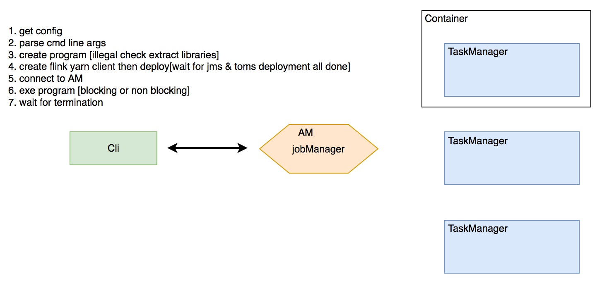
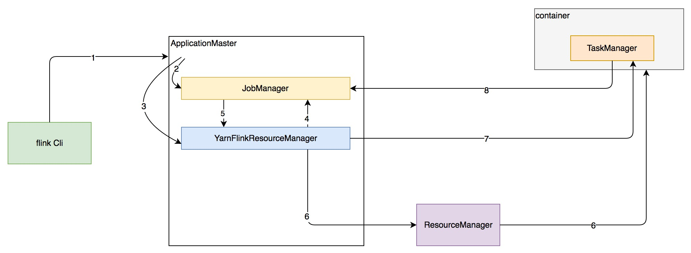
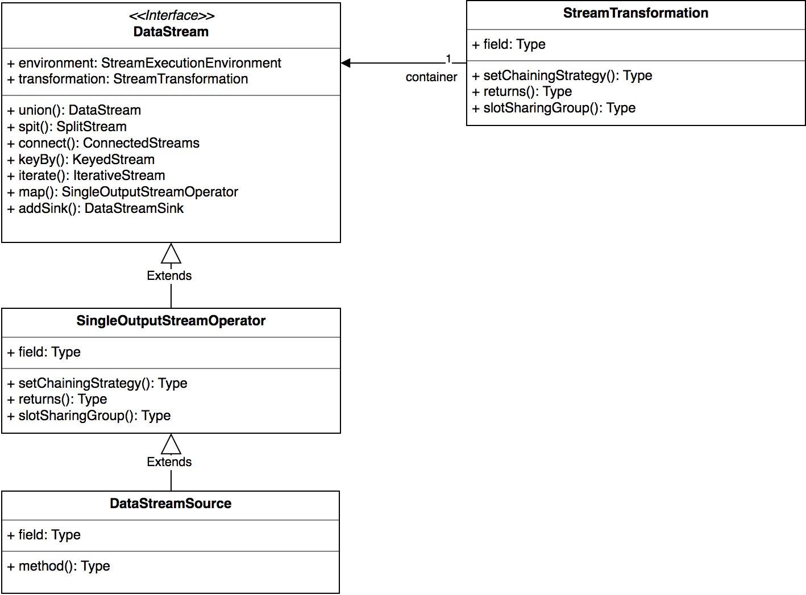
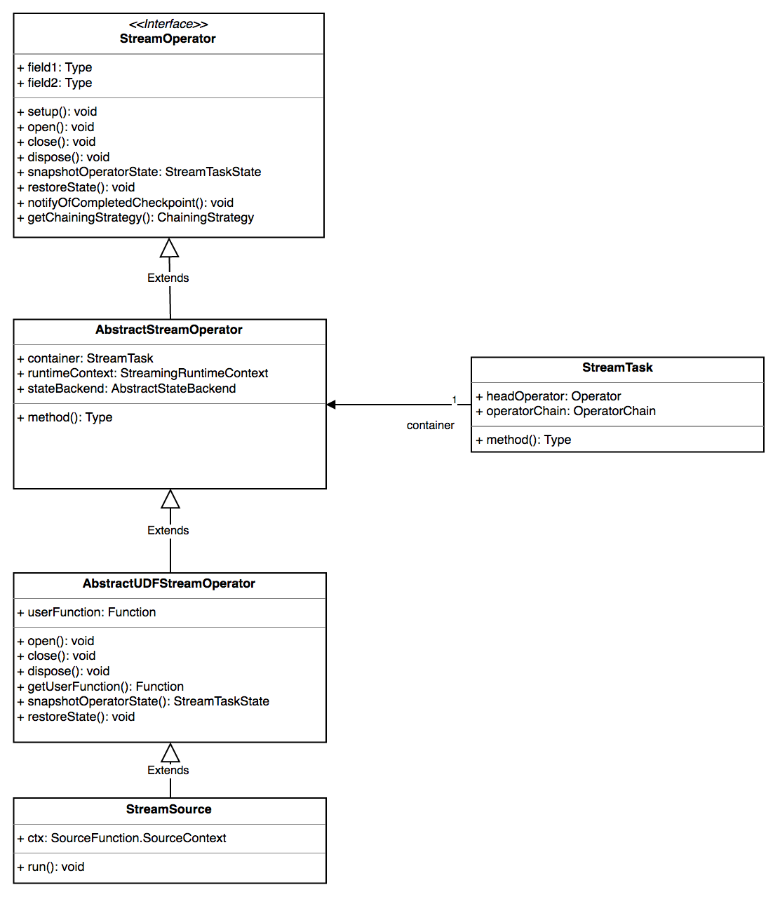
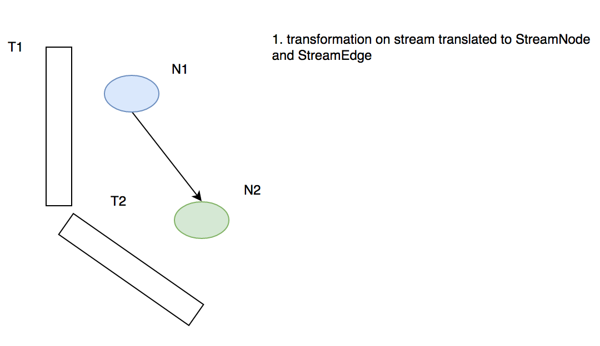
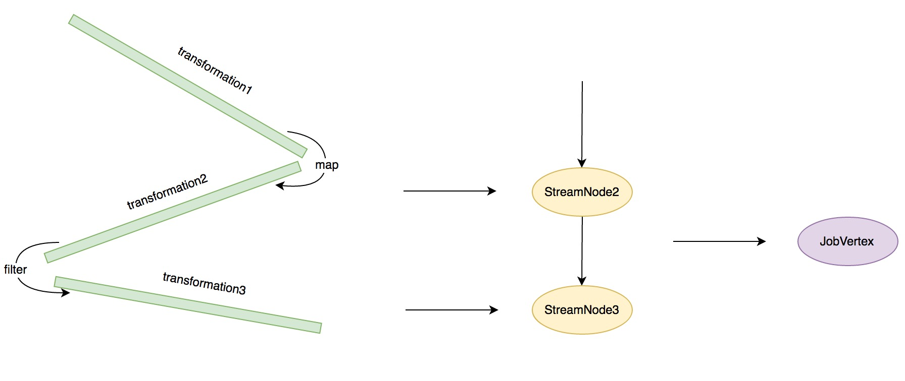

# Flink 基本组件和逻辑计划生成

## 概要和背景

*flink*是一个被誉为 *the 4th G* 的计算框架，不同的框架特性及其代表项目列表如下：

| 第一代              | 第二代                       | 第三代                                      | 第四代                                      |
| ---------------- | ------------------------- | ---------------------------------------- | ---------------------------------------- |
| Batch            | **Batch** **Interactive** | **Batch** **Interactive** **Near-Real-Time** **Interative-processing** | **Hybrid** **Interactive** **Real-Time-Streaming** **Native-Iterative-processing** |
|                  | DAG Dataflows             | RDD                                      | Cyclic Dataflows                         |
| Hadoop MapReduce | TEZ                       | Spark                                    | Flink                                    |

本文主要介绍*flink*的核心组件以及物理计划的生成过程

*参考代码分支 flink-1.1.2*

## 核心组件介绍

*这里只介绍 on yarn 模式下的组件*

*flink* 的 on yarn 模式支持两种不同的类型：

1. 单作业单集群
2. 多作业单集群

首先介绍 *单作业单集群* 的架构，单作业单集群下一个正常的 *flink* 程序会拥有以下组件

---

job Cli: 非 detatched 模式下的客户端进程，用以获取 yarn Application Master 的运行状态并将日志输出掉终端

JobManager[JM]: 负责作业的运行时计划 ExecutionGraph 的生成、物理计划生成和作业调度

TaskManager[TM]: 负责被分发 task 的执行、心跳/状态上报、资源管理

---

整体的架构大致如下图所示：



下面将以一次 Job 的提交过程描述 *flink* 的各组件的作用及协同

### 作业提交流程分析

单作业单集群模式下，一个作业会启动一个 JM，并依据用户的参数传递启动相应数量的 TM，每个 TM 运行在 yarn 的一个 container 中，

一个通常的 flink on yarn 提交命令：`./bin/flink run -m yarn-cluster -yn 2 -j flink-demo-1.0.0-with-dependencies.jar —ytm 1024 -yst 4 -yjm 1024 —yarnname flink_demo_waimai_e` *flink* 在收到这样一条命令后会首先通过 Cli 获取 flink 的配置，并解析命令行参数。

#### 配置加载

`CliFrontend.java` 是 flink 提交作业的入口

```java
//CliFrontend line144
public CliFrontend() throws Exception {
   this(getConfigurationDirectoryFromEnv());
}
```

这里会尝试加载 conf 文件夹下的所有 yaml 文件，配置文件的命名并没有强制限制

#### 参数解析

解析命令行参数的第一步是路由用户的命令，然后交由`run`方法去处理

```java
//CliFrontend line993
try {
    return SecurityUtils.runSecured(new SecurityUtils.FlinkSecuredRunner<Integer>() {
	    Override
	    public Integer run() throws Exception {
	        return CliFrontend.this.run(params);
		});
	}
	catch (Exception e) {
		return handleError(e);
	}
```

接下来是程序参数设置过程，*flink* 将 jar包路径和参数配置封装成了 `PackagedProgram` 

```java
//CliFrontend line223
PackagedProgram program;
try {
   LOG.info("Building program from JAR file");
   program = buildProgram(options);
}
catch (Throwable t) {
   return handleError(t);
}
```

#### flink集群的构建

##### 集群类型的解析

获取参数后下一步就是集群的构建和部署，flink 通过 两个不同的 `CustomCommandLine ` 来实现不同集群模式的解析，分别是 `FlinkYarnSessionCli`和 `DefaultCLI` 【吐槽一下 flink 类名的命名规范】解析命令行参数

```java
//CliFrontend line125
static {
   /** command line interface of the YARN session, with a special initialization here
    *  to prefix all options with y/yarn. */
   loadCustomCommandLine("org.apache.flink.yarn.cli.FlinkYarnSessionCli", "y", "yarn");
   customCommandLine.add(new DefaultCLI());
}
...
//line882 这里将决定Cli的类型
CustomCommandLine<?> activeCommandLine = getActiveCustomCommandLine(options.getCommandLine());
```

那么什么时候解析成 Yarn Cluster 什么时候解析成 Standalone 呢？由于`FlinkYarnSessionCli`被优先添加到`customCommandLine`,所以会先触发下面这段逻辑

```java
//FlinkYarnSessionCli line469
@Override
public boolean isActive(CommandLine commandLine, Configuration configuration) {
   String jobManagerOption = commandLine.getOptionValue(ADDRESS_OPTION.getOpt(), null);
   boolean yarnJobManager = ID.equals(jobManagerOption);
   boolean yarnAppId = commandLine.hasOption(APPLICATION_ID.getOpt());
   return yarnJobManager || yarnAppId || loadYarnPropertiesFile(commandLine, configuration) != null;
}
```

从上面可以看出如果用户传入了 `-m`参数或者`application id`或者配置了yarn properties 文件，则启动yarn cluster模式，否则是Standalone模式的集群

##### 集群部署

flink通过`YarnClusterDescriptor`来描述yarn集群的部署配置，具体对应的配置文件为`flink-conf.yaml`，通过下面这段逻辑触发集群部署：

```java
//AbstractYarnClusterDescriptor line372
/**
 * This method will block until the ApplicationMaster/JobManager have been
 * deployed on YARN.
 */
protected YarnClusterClient deployInternal() throws Exception {
```

大致列下过程：

- check yarn 集群队列资源是否满足请求
- 设置 AM Context、启动命令、submission context
- 如果开启高可用模式【通过反射调用 submission context 的两个方法修改属性】 keepContainersMethod    attemptFailuresValidityIntervalMethod 【和 Hadoop 的版本有关】第一个属性表示应用重试时是否保留 AM container，第二个属性表示 指定 间隔时间之内应用允许失败重启的次数
- 上传 用户 jar、flink-conf.yaml、lib 目录下所有的 jar 包、logback log4j配置文件 到 HDFS
- 通过 yarn client submit am context
- 将yarn client 及相关配置封装成 YarnClusterClient 返回

真正在 AM 中运行的主类是 `YarnApplicationMasterRunner`，它的 `run`方法做了如下工作：

-  启动JobManager ActorSystem
-  启动 flink ui
-  启动`YarnFlinkResourceManager`来负责与yarn的ResourceManager交互，管理yarn资源
-  启动 actor System supervise 进程

到这里 JobManager 已经启动起来，那么 TaskManager是什么时候起动的呢？

在 `YarnFlinkResourceManager`启动的时候会预先执行一段逻辑【Akka actor的preStart方法】：

```java
@Override
public void preStart() {
    try {
        // we start our leader retrieval service to make sure we get informed
        // about JobManager leader changes
        leaderRetriever.start(new LeaderRetrievalListener() {

		    @Override
		    public void notifyLeaderAddress(String leaderAddress, UUID leaderSessionID) {
		        self().tell(
						new NewLeaderAvailable(leaderAddress, leaderSessionID),
						ActorRef.noSender());
		    }
```

这段逻辑会先尝试获取 JobManager 的地址并给自己发送一个路由消息`NewLeaderAvailable`，然后`YarnFlinkResourceManager`会把自己注册到 `JobManager` 中，接着`JobManager`会发送一个回调命令：

```scala
//JobManager line358
sender ! decorateMessage(new RegisterResourceManagerSuccessful(self, taskManagerResources))
```

接着会触发这样一段逻辑：

```java
//FlinkResourceManager line555
private void checkWorkersPool() {
   int numWorkersPending = getNumWorkerRequestsPending();
   int numWorkersPendingRegistration = getNumWorkersPendingRegistration();

   // sanity checks
   Preconditions.checkState(numWorkersPending >= 0,
      "Number of pending workers should never be below 0.");
   Preconditions.checkState(numWorkersPendingRegistration >= 0,
      "Number of pending workers pending registration should never be below 0.");

   // see how many workers we want, and whether we have enough
   int allAvailableAndPending = startedWorkers.size() +
      numWorkersPending + numWorkersPendingRegistration;

   int missing = designatedPoolSize - allAvailableAndPending;

   if (missing > 0) {
      requestNewWorkers(missing);
   }
}
```

将所有的 TS 起动起来，这样一个 flink 集群便构建出来了。下面附图解释下这个流程：



1. flink cli 解析本地环境配置，启动 `ApplicationMaster`
2. 在 `ApplicationMaster` 中启动 `JobManager`
3. 在 `ApplicationMaster` 中启动`YarnFlinkResourceManager`
4. `YarnFlinkResourceManager`给`JobManager`发送注册信息
5. `YarnFlinkResourceManager`注册成功后，`JobManager`给`YarnFlinkResourceManager`发送注册成功信息
6. `YarnFlinkResourceManage`知道自己注册成功后像`ResourceManager`申请和`TaskManager`数量对等的 container
7. 在container中启动`TaskManager`
8. `TaskManager`将自己注册到`JobManager`中

*接下来便是程序的提交和运行*

程序在`CliFrontend`中被提交后，会触发这样一段逻辑

```java
//ClusterClient 304
	public JobSubmissionResult run(PackagedProgram prog, int parallelism)
			throws ProgramInvocationException
	{
		Thread.currentThread().setContextClassLoader(prog.getUserCodeClassLoader());
		...
		else if (prog.isUsingInteractiveMode()) {
			LOG.info("Starting program in interactive mode");
			ContextEnvironmentFactory factory = new ContextEnvironmentFactory(this, prog.getAllLibraries(),
					prog.getClasspaths(), prog.getUserCodeClassLoader(), parallelism, isDetached(),
					prog.getSavepointPath());
			ContextEnvironment.setAsContext(factory);

			try {
				// invoke main method
				prog.invokeInteractiveModeForExecution();
				...
			}
			finally {
				ContextEnvironment.unsetContext();
			}
		}
		else {
			throw new RuntimeException("PackagedProgram does not have a valid invocation mode.");
		}
	}
```

注意到有一段`prog.invokeInteractiveModeForExecution()`，这是客户端生成初步逻辑计划的核心逻辑，下面将详细介绍

### 客户端逻辑计划

上面提到`prog.invokeInteractiveModeForExecution()`这段逻辑会触发客户端逻辑计划的生成，那么是怎样一个过程呢？其实这里只是调用了用户jar包的主函数，真正的触发生成过程由用户代码的执行来完成。例如用户写了这样一段 flink 代码：

```java
object FlinkDemo extends App with Logging{
  override def main(args: Array[String]): Unit ={
    val properties = new Properties
    properties.setProperty("bootstrap.servers", DemoConfig.kafkaBrokerList)

 properties.setProperty("zookeeper.connect","host01:2181,host02:2181,host03:2181/kafka08")
    properties.setProperty("group.id", "flink-demo-waimai-e")

    val env = StreamExecutionEnvironment.getExecutionEnvironment
    env.enableCheckpointing(5000L, CheckpointingMode.EXACTLY_ONCE) //checkpoint every 5 seconds.
    val stream = env.addSource(new FlinkKafkaConsumer08[String]("log.waimai_e", new SimpleStringSchema, properties)).setParallelism(2)
    val counts = stream.name("log.waimai_e").map(toPoiIdTuple(_)).filter(_._2 != null)
      .keyBy(0)
      .timeWindow(Time.seconds(5))
      .sum(1)

    counts.addSink(sendToKafka(_))
    env.execute()
  }
```

注意到这样一段`val env = StreamExecutionEnvironment.getExecutionEnvironment`，这段代码会获取客户端的环境配置，它首先会转到这样一段逻辑：

```java
//StreamExecutionEnvironment 1256
public static StreamExecutionEnvironment getExecutionEnvironment() {
   if (contextEnvironmentFactory != null) {
      return contextEnvironmentFactory.createExecutionEnvironment();
   }

   // because the streaming project depends on "flink-clients" (and not the other way around)
   // we currently need to intercept the data set environment and create a dependent stream env.
   // this should be fixed once we rework the project dependencies
   
   ExecutionEnvironment env = ExecutionEnvironment.getExecutionEnvironment();
```

`ExecutionEnvironment.getExecutionEnvironment();`获取环境的逻辑如下：

```java
//ExecutionEnvironment line1137
public static ExecutionEnvironment getExecutionEnvironment() {
   return contextEnvironmentFactory == null ? 
         createLocalEnvironment() : contextEnvironmentFactory.createExecutionEnvironment();
}
```

这里的`contextEnvironmentFactory`是一个静态成员，早在`ContextEnvironment.setAsContext(factory)`已经触发过初始化了，其中包含了如下的环境信息:

```java
//ContextEnvironmentFactory line51
public ContextEnvironmentFactory(ClusterClient client, List<URL> jarFilesToAttach,
      List<URL> classpathsToAttach, ClassLoader userCodeClassLoader, int defaultParallelism,
      boolean isDetached, String savepointPath)
{
   this.client = client;
   this.jarFilesToAttach = jarFilesToAttach;
   this.classpathsToAttach = classpathsToAttach;
   this.userCodeClassLoader = userCodeClassLoader;
   this.defaultParallelism = defaultParallelism;
   this.isDetached = isDetached;
   this.savepointPath = savepointPath;
}
```

其中的 client 就是上面生成的 `YarnClusterClient`，其它的意思较明显，就不多做解释了。

用户在执行`val env = StreamExecutionEnvironment.getExecutionEnvironment`这样一段逻辑后会得到一个`StreamContextEnvironment`，其中封装了 streaming 的一些执行配置 【buffer time out等】，另外保存了上面提到的 `ContextEnvironmen`t 的引用。

到这里关于 streaming 需要的执行环境信息已经设置完成。

#### 初步逻辑计划 StreamGraph 的生成

接下来用户代码执行到`val stream = env.addSource(new FlinkKafkaConsumer08`，这段逻辑实际会生成一个`DataStream`抽象，`DataStream`是flink关于streaming抽象的最核心抽象，后续所有的算子转换都会在`DataStream`上来完成，上面的`addSource`操作会触发下面这段逻辑:

```java
public <OUT> DataStreamSource<OUT> addSource(SourceFunction<OUT> function, String sourceName, TypeInformation<OUT> typeInfo) {

   if(typeInfo == null) {
      if (function instanceof ResultTypeQueryable) {
         typeInfo = ((ResultTypeQueryable<OUT>) function).getProducedType();
      } else {
         try {
            typeInfo = TypeExtractor.createTypeInfo(
                  SourceFunction.class,
                  function.getClass(), 0, null, null);
         } catch (final InvalidTypesException e) {
            typeInfo = (TypeInformation<OUT>) new MissingTypeInfo(sourceName, e);
         }
      }
   }

   boolean isParallel = function instanceof ParallelSourceFunction;

   clean(function);
   StreamSource<OUT, ?> sourceOperator;
   if (function instanceof StoppableFunction) {
      sourceOperator = new StoppableStreamSource<>(cast2StoppableSourceFunction(function));
   } else {
      sourceOperator = new StreamSource<>(function);
   }

   return new DataStreamSource<>(this, typeInfo, sourceOperator, isParallel, sourceName);
}
```

简要总结下上面的逻辑：

- 获取数据源 source 的 output 信息 TypeInformation
- 生成 StreamSource sourceOperator
- 生成 DataStreamSource【封装了 sourceOperator】，并返回
- 将 StreamTransformation 添加到算子列表 transformations 中【只有 转换 transform 操作才会添加算子，其它都只是暂时做了 transformation 的叠加封装】
- 后续会在 DataStream 上做操作

该输出`DataStreamSource`继承自`SingleOutputStreamOperator`具体的继承关系如下：



而生成的 StreamSource operator 走的是另一套继承接口：



DataStreamSource 是一个 DataStream **数据流**抽象，StreamSource 是一个 StreamOperator **算子**抽象，在 flink 中一个 DataStream 封装了一次数据流转换，一个 StreamOperator 封装了一个函数接口，比如 map、reduce、keyBy等。*关于算子的介绍会另起一节：flink算子的声明周期*

可以看到在 DataStream 上可以进行一系列的操作(map filter 等)，来看一个常规操作比如 map 会发生什么：

```java
//DataStream line503
public <R> SingleOutputStreamOperator<R> map(MapFunction<T, R> mapper) {

   TypeInformation<R> outType = TypeExtractor.getMapReturnTypes(clean(mapper), getType(),
         Utils.getCallLocationName(), true);

   return transform("Map", outType, new StreamMap<>(clean(mapper)));
}
```

一个map操作会触发一次 transform，那么transform做了什么工作呢？

```java
//DataStream line1020
@PublicEvolving
public <R> SingleOutputStreamOperator<R> transform(String operatorName, TypeInformation<R> outTypeInfo, OneInputStreamOperator<T, R> operator) {

   // read the output type of the input Transform to coax out errors about MissingTypeInfo
   transformation.getOutputType();

   OneInputTransformation<T, R> resultTransform = new OneInputTransformation<>(
         this.transformation,
         operatorName,
         operator,
         outTypeInfo,
         environment.getParallelism());

   @SuppressWarnings({ "unchecked", "rawtypes" })
   SingleOutputStreamOperator<R> returnStream = new SingleOutputStreamOperator(environment, resultTransform);

   getExecutionEnvironment().addOperator(resultTransform);

   return returnStream;
}
```

这一步生成了一个 `StreamTransformation`并以此作为成员变量封装成另一个 DataStream 返回，`StreamTransformation`是 flink关于数据流转换的核心抽象，只有需要 transform 的流才会生成新的DataStream 算子，后面会详细解释，注意上面有这一行`getExecutionEnvironment().addOperator(resultTransform)`flink会将transformation维护起来：

```java
//StreamExecutionEnvironment line 1237
@Internal
public void addOperator(StreamTransformation<?> transformation) {
   Preconditions.checkNotNull(transformation, "transformation must not be null.");
   this.transformations.add(transformation);
}
```

所以，用户的一连串操作 map join等实际上在 DataStream 上做了转换，并且flink将这些 `StreamTransformation` 维护起来，一直到最后，用户执行 `env.execute()`这样一段逻辑，StreamGraph 的构建才算真正开始...

用户在执行` env.execute()`会触发这样一段逻辑：

```java
//StreamContextEnvironment line51   
public JobExecutionResult execute(String jobName) throws Exception {
      Preconditions.checkNotNull("Streaming Job name should not be null.");

      StreamGraph streamGraph = this.getStreamGraph();
      streamGraph.setJobName(jobName);

      transformations.clear();

      // execute the programs
      if (ctx instanceof DetachedEnvironment) {
         LOG.warn("Job was executed in detached mode, the results will be available on completion.");
         ((DetachedEnvironment) ctx).setDetachedPlan(streamGraph);
         return DetachedEnvironment.DetachedJobExecutionResult.INSTANCE;
      } else {
         return ctx.getClient().runBlocking(streamGraph, ctx.getJars(), ctx.getClasspaths(), ctx.getUserCodeClassLoader(), ctx.getSavepointPath());
      }
   }
}
```

这段代码做了两件事情：

- 首先使用 `StreamGraphGenerator` 产生 StreamGraph
- 使用 Client 运行 stream graph

那么` StreamGraphGenerator` 做了哪些操作呢？

` StreamGraphGenerator`会依据添加算子时保存的 transformations 信息生成 job graph 中的节点，并创建节点连接，分流操作 如 union,select,split 不会添加边，只会创建虚拟节点或在上有节点添加 selector

这里会将 StreamTransformation 转换为 StreamNode，StreamNode 保存了算子的信息【会另外介绍】，如下图所示



到这里由 `StreamNode` 构成的 DAG 图 `StreamGraph`就生成了

不过 在提交给 client 的时候，flink 会做进一步的优化:

 `StreamGraph` 将进一步转换为 `JobGraph`，这一步工作由 `StreamingJobGraphGenerator` 来完成，为什么要做这一步转换呢？主要因为有可以 chain 的算子，这里进一步将 StreamNode 转换为 JobVertex，主要工作是将可以 chain 的算子合并【这一步优化是默认打开的】，并设置资源，重试策略等，最终生成可以提交给 JobManager 的 JobGraph

#### 优化的逻辑计划 JobGraph 的生成

```java
//StreamingJobGraphGenerator line181
private List<StreamEdge> createChain(
      Integer startNodeId,
      Integer currentNodeId,
      Map<Integer, byte[]> hashes) {

   if (!builtVertices.contains(startNodeId)) {

      List<StreamEdge> transitiveOutEdges = new ArrayList<StreamEdge>();

      List<StreamEdge> chainableOutputs = new ArrayList<StreamEdge>();
      List<StreamEdge> nonChainableOutputs = new ArrayList<StreamEdge>();

      for (StreamEdge outEdge : streamGraph.getStreamNode(currentNodeId).getOutEdges()) {
         if (isChainable(outEdge)) {
            chainableOutputs.add(outEdge);
         } else {
            nonChainableOutputs.add(outEdge);
         }
      }

      for (StreamEdge chainable : chainableOutputs) {
         transitiveOutEdges.addAll(createChain(startNodeId, chainable.getTargetId(), hashes));
      }
     ...
```

上面的方法是算子 chain 的核心操作，简要概括下：

- 如果从此 start node 开始未生成过 JobVertex，则执行 chain逻辑，由于是递归操作，会先深度优先遍历，将源节点开始到第一个不可 chain 的 StreamNode 之间的算子做 chain 操作【先算叶子节点的 chain，依次往根节点计算】
- line 207 遇到不可 chain 的边，开始深度遍历生成 JobVertex
- line 216 将 StreamNode 的输入输出配置，包括序列化配置等设置到上面的 StreamingConfig 中，并在 vertexConfigs 中保存起来，如果是 新生成的 JobVertex，起对应的 StreamingConfig 会以 start node id 为 key 进行保存
- transitiveOutEdges 保存的该节点下游所有的 non chain_able  edges，最终的方法会返回此数据结构
- 连接 start node 和所有的 transitiveOutEdges 【在输入 JobVertex 创建 IntermediateDataSet，partition类型为 pipeline，生成 JobEdge】
- 如果是新生成JobVertex，继续设置config，包括 chain start，所有物理输出，及直接逻辑输出、chained config等
- 如果不是新生成 JobVertex，直接chain configs

这里总结下JobGraph的构建过程，见下图:



大致过程总结如下：

- 由`DataStream`上的操作生成`StreamTransformation`列表
- 从`StreamTransformation`的生成关系创建`StreamNode`和`StreamEdge`
- 做算子chain，合并成 `JobVertex`，并生成 `JobEdge`

一个 JobVertex 代表一个逻辑计划的节点，就是 DAG 图上的顶点，有点类似于 Storm 的 bolt 或 spout，生成一个 JobVertex 的逻辑如下：

```java
//StreamingJobGenerator line258
private StreamConfig createJobVertex(
      Integer streamNodeId,
      Map<Integer, byte[]> hashes) {

   JobVertex jobVertex;
   ...
   JobVertexID jobVertexId = new JobVertexID(hash);

   if (streamNode.getInputFormat() != null) {
      jobVertex = new InputFormatVertex(
            chainedNames.get(streamNodeId),
            jobVertexId);
      TaskConfig taskConfig = new TaskConfig(jobVertex.getConfiguration());
      taskConfig.setStubWrapper(new UserCodeObjectWrapper<Object>(streamNode.getInputFormat()));
   } else {
      jobVertex = new JobVertex(
            chainedNames.get(streamNodeId),
            jobVertexId);
   }

   jobVertex.setInvokableClass(streamNode.getJobVertexClass());

   ...

   return new StreamConfig(jobVertex.getConfiguration());
}
```

*这里有两段逻辑值得注意，第一是数据源节点的判断，第二是运行时执行类 InvokableClass 的设置*

`streamNode.getInputFormat()`是判断是否是数据源节点的逻辑，如果是数据源节点，这里会将用户代码【这里为 InputFormat.class 的子类】设置进 JobVertex 的配置中，并在 JobManager 执行提交作业命令的时候做初始化，会在 Flink 物理计划生成一节介绍。

`jobVertex.setInvokableClass`是设置运行时的执行类，通过这个类再调用用户定义的 operator，是 flink task 中真正被执行的类，具体会在 flink-task-runtime 一节中详细介绍。

至此 JobGraph 生成，并扔给 JobManager 执行😝