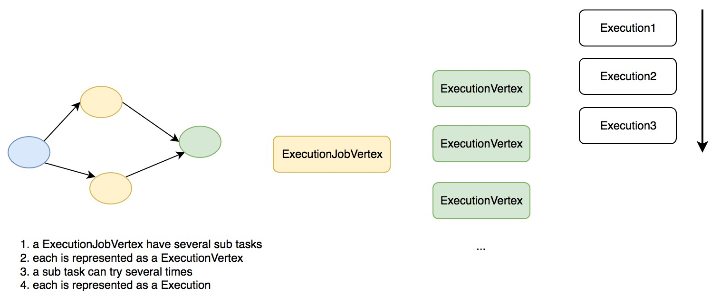
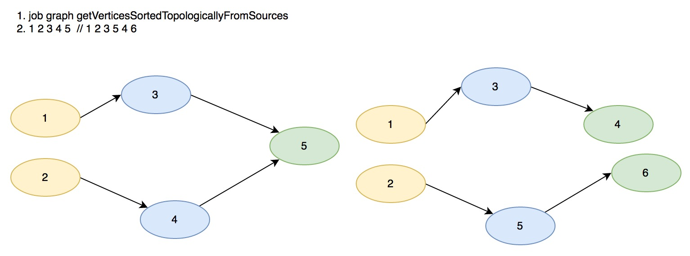
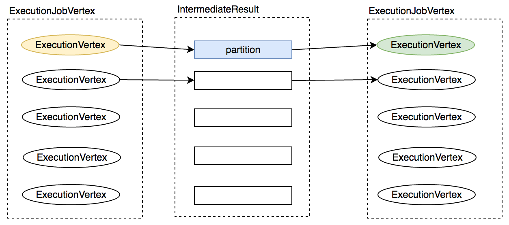
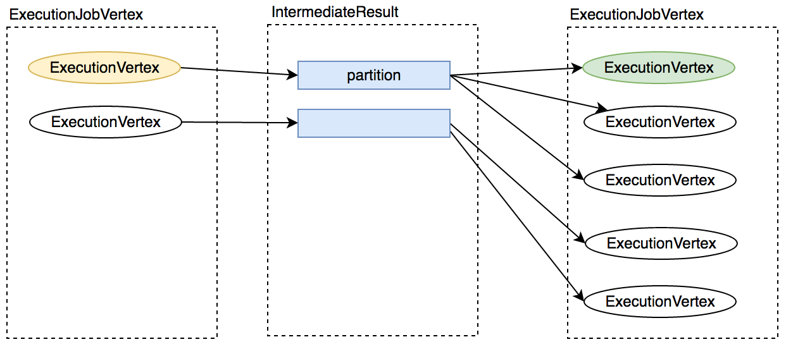
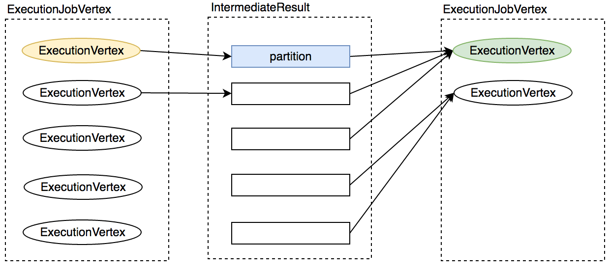

# Flink执行计划生成

## 前言

上一节讲到业务代码`StreamExecutionEnvironment.execute()`会触发job的客户端逻辑计划`JobGraph` 的生成，之后是客户端与`JobManager`的交互过程

```java
//ClusterClient line388
public JobExecutionResult run(JobGraph jobGraph, ClassLoader classLoader) throws ProgramInvocationException {

   waitForClusterToBeReady();

   final LeaderRetrievalService leaderRetrievalService;
   try {
      leaderRetrievalService = LeaderRetrievalUtils.createLeaderRetrievalService(flinkConfig);
   } catch (Exception e) {
      throw new ProgramInvocationException("Could not create the leader retrieval service", e);
   }

   try {
      logAndSysout("Submitting job with JobID: " + jobGraph.getJobID() + ". Waiting for job completion.");
      this.lastJobExecutionResult = JobClient.submitJobAndWait(actorSystemLoader.get(),
         leaderRetrievalService, jobGraph, timeout, printStatusDuringExecution, classLoader);
      return this.lastJobExecutionResult;
   } catch (JobExecutionException e) {
      throw new ProgramInvocationException("The program execution failed: " + e.getMessage(), e);
   }
}
```
其中`leaderRetrievalService = LeaderRetrievalUtils.createLeaderRetrievalService(flinkConfig);`是启动获取 leader JobManager 的服务，flink 支持 JobManager HA，需要通过 leader JobManager 获取当前的 leader JobManager，稍微介绍下这个服务：

## JobManager Leader 选举

先来看获取 `LeaderRetrievalService`的逻辑：

```java
//LeaderRetrievalUtils line61
public static LeaderRetrievalService createLeaderRetrievalService(Configuration configuration)
   throws Exception {

   RecoveryMode recoveryMode = getRecoveryMode(configuration);

   switch (recoveryMode) {
      case STANDALONE:
         return StandaloneUtils.createLeaderRetrievalService(configuration);
      case ZOOKEEPER:
         return ZooKeeperUtils.createLeaderRetrievalService(configuration);
      default:
         throw new Exception("Recovery mode " + recoveryMode + " is not supported.");
   }
}
```

首先 flink 会依据配置获取 `RecoveryMode`，`RecoveryMode`一共两种：*STANDALONE*和*ZOOKEEPER*。如果用户配置的是*STANDALONE*，会直接去配置中获取`JobManager`的地址，这里主要介绍`ZOOKEEPER`模式下的`JobManager`leader的发现过程：

```java
//ZooKeeperUtils line141
public static ZooKeeperLeaderRetrievalService createLeaderRetrievalService(
      Configuration configuration) throws Exception {
   CuratorFramework client = startCuratorFramework(configuration);
   String leaderPath = configuration.getString(ConfigConstants.ZOOKEEPER_LEADER_PATH,
         ConfigConstants.DEFAULT_ZOOKEEPER_LEADER_PATH);

   return new ZooKeeperLeaderRetrievalService(client, leaderPath);
}

...
//ZooKeeperLeaderRetrievalService line103
	public void nodeChanged() throws Exception {
		try {
			LOG.debug("Leader node has changed.");

			ChildData childData = cache.getCurrentData();

			String leaderAddress;
			UUID leaderSessionID;

			if (childData == null) {
				leaderAddress = null;
				leaderSessionID = null;
			} else {
				byte[] data = childData.getData();

				if (data == null || data.length == 0) {
					leaderAddress = null;
					leaderSessionID = null;
				} else {
					ByteArrayInputStream bais = new ByteArrayInputStream(data);
					ObjectInputStream ois = new ObjectInputStream(bais);

					leaderAddress = ois.readUTF();
					leaderSessionID = (UUID) ois.readObject();
```

这里 flink 会首先尝试连接 zookeeper，利用 zookeeper的leader选举服务发现leader节点的地址和当前的 sessionid，session id的作用介绍`JobManager`的时候会详细说明

## 客户端JobGraph的提交

客户端的`JobGraph`生成之后，通过上面的`LeaderRetrivalService`获取`JobManager`的地址，接下来就是将`JobGraph`提交给`JobManager`去执行。flink 的核心进程通信是通过 Akka 来完成的，`JobManager`、`TaskManager`都是一个 Akka system，所以这里的提交首先需要生成一个客户端actor与`JobManager`交互，然后执行rpc命令，具体见：

```java
//JobClient line98
public static JobExecutionResult submitJobAndWait(
      ActorSystem actorSystem,
      LeaderRetrievalService leaderRetrievalService,
      JobGraph jobGraph,
      FiniteDuration timeout,
      boolean sysoutLogUpdates,
      ClassLoader classLoader) throws JobExecutionException {

   ...

   // for this job, we create a proxy JobClientActor that deals with all communication with
   // the JobManager. It forwards the job submission, checks the success/failure responses, logs
   // update messages, watches for disconnect between client and JobManager, ...

   Props jobClientActorProps = JobClientActor.createJobClientActorProps(
      leaderRetrievalService,
      timeout,
      sysoutLogUpdates);

   ActorRef jobClientActor = actorSystem.actorOf(jobClientActorProps);
   
   // first block handles errors while waiting for the result
   Object answer;
   try {
      Future<Object> future = Patterns.ask(jobClientActor,
            new JobClientMessages.SubmitJobAndWait(jobGraph),
            new Timeout(AkkaUtils.INF_TIMEOUT()));
      
      answer = Await.result(future, AkkaUtils.INF_TIMEOUT());
   }
   ...
```

在`JobClientActor`启动之前会启动`LeaderRetrivalService`，`LeaderRetrivalService`启动之后会通知它的 Listener `JobClientActor `获取` JobManager`的地址和当前 session id。之后经过消息路由跳转到提交的核心逻辑：

```java
//JobClientActor line354
private void tryToSubmitJob(final JobGraph jobGraph) {
   this.jobGraph = jobGraph;

   if (isConnected()) {
      LOG.info("Sending message to JobManager {} to submit job {} ({}) and wait for progress",
         jobManager.path().toString(), jobGraph.getName(), jobGraph.getJobID());

      Futures.future(new Callable<Object>() {
         @Override
         public Object call() throws Exception {
            ActorGateway jobManagerGateway = new AkkaActorGateway(jobManager, leaderSessionID);

            LOG.info("Upload jar files to job manager {}.", jobManager.path());

            try {
               jobGraph.uploadUserJars(jobManagerGateway, timeout);
```

上面的代码有所省略😝。

总结下上面的过程：


- 启动`JobClientActor`用来和`JobManager`交互
- 启动`LeaderRetrievalService`获取`JobManager`的地址
- 上传用户 jar 包
- 提交 SubmitJob 命令

## JobManager执行计划生成

`JobManager`负责接收 flink 的作业，调度 task，收集 job 的状态、管理 TaskManagers。被实现为一个 akka actor。

客户端上传完 jar 包和`JobGraph`，flink 会进一步解析封装成运行时的执行计划`ExecutionGraph`，`JobManager`的构造器在初始化的时候传入了很多组件，这里简单列举下功能方便后面的逻辑展开，具体的细节将会在下一节讲解。

- `BlobServer`：实现了 BOLB server，其会监听收到的 requests，并会创建 目录结构存储 BLOBS 【持久化】或者临时性的缓存他们
- `InstanceManager`：TaskManager在`flink`框架内部被叫做`Instance`，flink通过`InstanceManager`管理 flink 集群中当前所有活跃的 TaskManager，包括接收心跳，通知 InstanceListener Instance 的生成与死亡，一个典型的 `InstanceListener` 为 flink 的 Scheduler
- `BlobLibraryCacheManager`：flink job 的 jar 包存储服务，使用上面的 BlobServer 完成。
- `MemoryArchivist`备案已提交的flink作业，包括`JobGraph`、`ExecutionGraph`等
- ​
- `ZooKeeperCompletedCheckpointStore`：负责持久化 job 的 checkpoint 信息，一个 job 可以持久化多个 checkpoint，但只有最新的会被使用，具体方式为先在文件系统中持久化一份，再将文件句柄更新到 zk，并在 zk上依次递增节点路径号，zk 上保存了最近的 10 次 checkpoint
- SavepointStore：flink 的状态存储，负责存储算子内部定义的状态，与 checkpoint 稍有区别，后者由 flink 框架来维护

*为了对`JobManager`中所起的 actors 服务有所了解，这里简单介绍下`JobManager`的启动过程*

简单分析得知`line2049: runJobManager`是JobManager启动的入口，在获取`JobManager`启动的主机和端口后，变开始启动 actor system，web ui以及其他 actors：

```java
//JobManager line2008
def runJobManager(
    configuration: Configuration,
    executionMode: JobManagerMode,
    listeningAddress: String,
    listeningPort: Int)
  : Unit = {

  val (jobManagerSystem, _, _, webMonitorOption, _) = startActorSystemAndJobManagerActors(
    configuration,
    executionMode,
    listeningAddress,
    listeningPort,
    classOf[JobManager],
    classOf[MemoryArchivist],
    Option(classOf[StandaloneResourceManager])
  )

  // block until everything is shut down
  jobManagerSystem.awaitTermination()
```

具体的启动逻辑在`startActorSystemAndJobManagerActors`方法中：

```java
//JobManager line2150
def startActorSystemAndJobManagerActors(
    configuration: Configuration,
    executionMode: JobManagerMode,
    listeningAddress: String,
    listeningPort: Int,
    jobManagerClass: Class[_ <: JobManager],
    archiveClass: Class[_ <: MemoryArchivist],
    resourceManagerClass: Option[Class[_ <: FlinkResourceManager[_]]])
  : (ActorSystem, ActorRef, ActorRef, Option[WebMonitor], Option[ActorRef]) = {
  ...
```

简单列举下逻辑：

- JobManager 程序的主入口，由 ApplicationMasterBase 发起
- line 2174 使用 Json 配置 Akka 并生成 ActorSystem
- line 2197 初始化 ZooKeeperLeaderRetrievalService，JobManager在启动的时候会以 LeaderRetrievalListener 的身份将自己注册进来，该 service 负责监听最新的 leader 信息，当发生改变时 通知所有 listener【所有的 JobManager】
- line 2220 启动 YarnJobManager 和 MemoryArchivist actors【这里并没有启动】
- line2268 启动【flink基本组件和JobGraph的生成一节中提到的】FlinkResourceManager
- line 2620 createJobManagerComponents 获取以上两个组件必要的配置，并初始化相关服务 具体见【 flink JobManager 中所起的服务】这里在初始化相关组件后会初始化 JobManager，akka actorOf 方法传入的属性为构造器中参数，重载 preStart 和 postStop 方法会在 actor 启动和关闭后 相继执行，JobManager 会在这两个方法中启动和停止这些服务

到这里一个完整的`JobManager` actor 便启动起来了😜

既然是 actor ，那么他的核心逻辑一定是各种消息的路由和处理：

```java
//JobManager line304
override def handleMessage: Receive = {

  case GrantLeadership(newLeaderSessionID) =>
    log.info(s"JobManager $getAddress was granted leadership with leader session ID " +
      s"$newLeaderSessionID.")

    leaderSessionID = newLeaderSessionID
```

介绍下这里比较重要的几种消息：

- 处理消息的核心方法
- GrantLeadership 获得leader授权，将自身被分发到的 session id 写到 zookeeper，并恢复所有的 jobs.
- RevokeLeadership 剥夺leader授权，打断清空所有的 job 信息，但是保留作业缓存，注销所有的 TaskManagers. 
- RegisterTaskManagers 注册 TaskManager，如果之前已经注册过，则只给对应的 Instance 发送消息，否则启动注册逻辑：在 InstanceManager 中注册该 Instance 的信息，并停止 Instance BlobLibraryCacheManager 的端口【供下载 lib 包用】，同时使用 watch 监听 task manager 的存活
- SubmitJob 提交 jobGraph

### 执行计划 ExecutionGraph 的生成

flink 的运行时执行计划为 ExecutionGraph，ExecutionGraph 对应之前的 JobGraph，一个 ExecutionGraph 包含多个 ExecutionJobVertex 节点，JobGraph 的 JobVertex，每个 ExecutionJobVertex 节点的并发子 task 对应一个 ExecutionVertex，每个 ExecutionVertex 的一次 attempt 执行被抽象为一次 Execution，具体如下图所示：



*下面会对每个抽象做详细的介绍*

ExecutionGraph 的创建是在 JobManager 接收 SubmitJob 命令后开始的，这条消息会被路由到方法：

```java
//JobManager line1048
private def submitJob(jobGraph: JobGraph, jobInfo: JobInfo, isRecovery: Boolean = false): Unit = {
  if (jobGraph == null) {
    jobInfo.client ! decorateMessage(JobResultFailure(
      new SerializedThrowable(
        new JobSubmissionException(null, "JobGraph must not be null.")
      )
    ))
  }
```

其逻辑总结如下：

- 提交作业
- 具体的组件交互过程 Client.java line169 runBlocking -> JobClient.java line102 submitJobAndWait -> JobClientActor.java line 337 tryToSubmitJob  这里会先上传 jars 到 JobManager 的 BlobServer，然后发起提交命令
- line1068: 设置用户lib包，使用  LibraryCacheManager book job 的jar包，由于之前包已上传，这会创建jobId 和 jars 以及class paths 的对应关系
- line1114: 将 JobGraph 转换为 ExecutionGraph 逻辑计划转化为物理计划【后者维护 data flow 的协调执行、连接、计算中间结果】具体见章节： flink runtime
- line 1178 ExecutionJobVertex 在此处生成，通过 JobGraph 依照数据源顺序获取下游 JobVertex，具体算法如下：



flink排序节点的顺序：

- 数据源节点
- 只有一个上游的节点
- sink节点

*例如上图的两个拓扑结构，左边节点排序完的顺序为： 1 2 3 4 5 右边的节点排序完的顺序为：1 2 3 5 4 6*

那么 flink 为什么要将 JobGraph 转换为 ExecutionGraph ，并且排序这些节点呢？ExecutionGraph 代表了运行时的执行计划，包括 task 的并发、连接、中间结果的维护等，排序的目的是给 task 的部署设置先后顺序，想来也是很自然的。我们来看一下 ExecutionGraph 的构造器就能了解个大概：

```java
public ExecutionGraph(
      ExecutionContext executionContext,
      JobID jobId,
      String jobName,
      Configuration jobConfig,
      SerializedValue<ExecutionConfig> serializedConfig,
      FiniteDuration timeout,
      RestartStrategy restartStrategy,
      List<BlobKey> requiredJarFiles,
      List<URL> requiredClasspaths,
      ClassLoader userClassLoader,
      MetricGroup metricGroup) {

   ...

   this.executionContext = executionContext;

   this.jobID = jobId;
   this.jobName = jobName;
   this.jobConfiguration = jobConfig;
   this.userClassLoader = userClassLoader;

   this.tasks = new ConcurrentHashMap<JobVertexID, ExecutionJobVertex>();
   this.intermediateResults = new ConcurrentHashMap<IntermediateDataSetID, IntermediateResult>();
   this.verticesInCreationOrder = new ArrayList<ExecutionJobVertex>();
   this.currentExecutions = new ConcurrentHashMap<ExecutionAttemptID, Execution>();

   this.jobStatusListenerActors  = new CopyOnWriteArrayList<ActorGateway>();
   this.executionListenerActors = new CopyOnWriteArrayList<ActorGateway>();

   this.stateTimestamps = new long[JobStatus.values().length];
   this.stateTimestamps[JobStatus.CREATED.ordinal()] = System.currentTimeMillis();

   this.requiredJarFiles = requiredJarFiles;
   this.requiredClasspaths = requiredClasspaths;

   this.serializedExecutionConfig = checkNotNull(serializedConfig);

   this.timeout = timeout;

   this.restartStrategy = restartStrategy;

   metricGroup.gauge(RESTARTING_TIME_METRIC_NAME, new RestartTimeGauge());
}
```

从构造器可以看出，ExecutionGraph 会维护当前的逻辑计划信息【就是有哪些task要执行】、中间结果生成信息，当前正在运行的 task，负责 job 和 task 状态切换的通知等。

#### 执行计划节点 ExecutionJobVertex 的生成

attachJobGraph 是 ExecutionGraph 构造图结构的核心方法，而其中最关键的逻辑是 执行节点 ExecutionJobGraph 的创建，下面详细分析下其创建过程和核心功能：

```java
//ExecutionJobVertex line95
public ExecutionJobVertex(ExecutionGraph graph, JobVertex jobVertex,
                  int defaultParallelism, FiniteDuration timeout, long createTimestamp)
      throws JobException
{
   ...
   this.graph = graph;
   this.jobVertex = jobVertex;
   
   int vertexParallelism = jobVertex.getParallelism();
   int numTaskVertices = vertexParallelism > 0 ? vertexParallelism : defaultParallelism;
   
   this.parallelism = numTaskVertices;
   this.taskVertices = new ExecutionVertex[numTaskVertices];
   
   this.inputs = new ArrayList<IntermediateResult>(jobVertex.getInputs().size());
   
   // take the sharing group
   this.slotSharingGroup = jobVertex.getSlotSharingGroup();
   this.coLocationGroup = jobVertex.getCoLocationGroup();
   ...
   
   // create the intermediate results
   this.producedDataSets = new IntermediateResult[jobVertex.getNumberOfProducedIntermediateDataSets()];

   for (int i = 0; i < jobVertex.getProducedDataSets().size(); i++) {
      final IntermediateDataSet result = jobVertex.getProducedDataSets().get(i);

      this.producedDataSets[i] = new IntermediateResult(
            result.getId(),
            this,
            numTaskVertices,
            result.getResultType(),
            result.getEagerlyDeployConsumers());
   }

   // create all task vertices
   for (int i = 0; i < numTaskVertices; i++) {
      ExecutionVertex vertex = new ExecutionVertex(this, i, this.producedDataSets, timeout, createTimestamp);
      this.taskVertices[i] = vertex;
   }
   ...
   
   // set up the input splits, if the vertex has any
   try {
      @SuppressWarnings("unchecked")
      InputSplitSource<InputSplit> splitSource = (InputSplitSource<InputSplit>) jobVertex.getInputSplitSource();
      
      if (splitSource != null) {
         inputSplits = splitSource.createInputSplits(numTaskVertices);
         
         if (inputSplits != null) {
            if (splitSource instanceof StrictlyLocalAssignment) {
               inputSplitsPerSubtask = computeLocalInputSplitsPerTask(inputSplits);
               splitAssigner = new PredeterminedInputSplitAssigner(inputSplitsPerSubtask);
            } else {
               splitAssigner = splitSource.getInputSplitAssigner(inputSplits);
            }
         }
      }
      else {
         inputSplits = null;
      }
   }
   catch (Throwable t) {
      throw new JobException("Creating the input splits caused an error: " + t.getMessage(), t);
   }
   
   finishedSubtasks = new boolean[parallelism];
}
```

简要介绍下其构建逻辑：

- 依据对应的 JobVetex 的并发生成对应个数的 ExecutionVertex，一个 ExecutionVertex 代表一个 ExecutionJobVertex 的并发子 task
- 设置 SlotSharingGroup 和 CoLocationGroup，这两个组件是 flink 运行时任务调度的核心抽象，会约束 flink 调度 task 的策略，在 flink 任务调度算法 一节会详细介绍
- 将原来 JobVertex 的中间结果 IntermediateDataSet 转化为 IntermediateResult，后者在前者的基础上加入了 当前正在运行的 producer 信息，是真正关于运行时中间数据的抽象
- 如果对应的 job 节点是数据源节点，会获取其 InputSplitSource，InputSplitSource 控制了数据源并发子 task 和生产的 InputSplit 的对应关系，一个 InputSplit 代表一个数据源分片，对于 flink streaming 来说，InputSplitSource 就是一个 InputFormat，对应一个输入源 task 
- 这里的 InputSplitSource 是在什么时候设置进去的呢？见`JobManager line1163 vertex.initializeOnMaster(userCodeLoader)`以及`StreamingJobGraphGenerator.java line 278 createDataSourceVertex `

#### 执行计划节点 ExecutionJobVertex 的连接

构建完节点后通过连接生成执行计划 DAG【见ExecutionGraph attachJobGraph 方法】，connectToPredecessors 是连接执行节点的核心逻辑：

```java
//ExecutionJobGraph line237
public void connectToPredecessors(Map<IntermediateDataSetID, IntermediateResult> intermediateDataSets) throws JobException {
   
   List<JobEdge> inputs = jobVertex.getInputs();
   
   ...
   
   for (int num = 0; num < inputs.size(); num++) {
      JobEdge edge = inputs.get(num);
      
      ...
      
      // fetch the intermediate result via ID. if it does not exist, then it either has not been created, or the order
      // in which this method is called for the job vertices is not a topological order
      IntermediateResult ires = intermediateDataSets.get(edge.getSourceId());
      if (ires == null) {
         throw new JobException("Cannot connect this job graph to the previous graph. No previous intermediate result found for ID "
               + edge.getSourceId());
      }
      
      this.inputs.add(ires);
      
      int consumerIndex = ires.registerConsumer();
      
      for (int i = 0; i < parallelism; i++) {
         ExecutionVertex ev = taskVertices[i];
         ev.connectSource(num, ires, edge, consumerIndex);
      }
   }
}
```

简要概括逻辑如下：

- 设置输入 IntermediateResult
- 将自己注册到  IntermediateResult，目前一个 IntermediateResult 只支持一个 消费 ExecutionJobVertex 节点
- 设置并发子 task ExecutionVertex 和中间结果 IntermediateResult 的连接关系，通过 ExecutionVertex 的 connectSource  方法设置 ExecutionVertex 的连接策略，策略一共两种： POINT_WISE ALL_TO_ALL 前者上游 partition 与下游 consumers 之间是一对多关系，后者是 all to all 关系，这里会将 ExecutionEdge 创建出来并添加 consumer 为此 edge【partition在 new ExecutionVertex时创建出来，由 ExecutionVertex 构造器可知一个 ExecutionVertex 生产一个 partition，partition number 就是 sub task index】

#### 执行节点子任务 ExecutionVertex

先看一下 ExecutionVertex 的创建过程：

```java
public ExecutionVertex(
      ExecutionJobVertex jobVertex,
      int subTaskIndex,
      IntermediateResult[] producedDataSets,
      FiniteDuration timeout,
      long createTimestamp) {
   this.jobVertex = jobVertex;
   this.subTaskIndex = subTaskIndex;

   this.resultPartitions = new LinkedHashMap<IntermediateResultPartitionID, IntermediateResultPartition>(producedDataSets.length, 1);

   for (IntermediateResult result : producedDataSets) {
      IntermediateResultPartition irp = new IntermediateResultPartition(result, this, subTaskIndex);
      result.setPartition(subTaskIndex, irp);

      resultPartitions.put(irp.getPartitionId(), irp);
   }

   this.inputEdges = new ExecutionEdge[jobVertex.getJobVertex().getInputs().size()][];

   this.priorExecutions = new CopyOnWriteArrayList<Execution>();

   this.currentExecution = new Execution(
      getExecutionGraph().getExecutionContext(),
      this,
      0,
      createTimestamp,
      timeout);

   // create a co-location scheduling hint, if necessary
   CoLocationGroup clg = jobVertex.getCoLocationGroup();
   if (clg != null) {
      this.locationConstraint = clg.getLocationConstraint(subTaskIndex);
   }
   else {
      this.locationConstraint = null;
   }

   this.timeout = timeout;
}
```

逻辑总结如下：

- 依据对应的 ExecutionJobGraph 生成的中间数据集 IntermediateResult 的个数生成一定个数的 partition，这里是一个 IntermediateResult 输出一个 partition
- 生成 Execution
- 配置资源相关

下面重点介绍下其连接上游 ExecutionVertex 的过程：

connectSource 是连接的核心逻辑，逻辑如下:

```java
//ExecutionVertex line250
public void connectSource(int inputNumber, IntermediateResult source, JobEdge edge, int consumerNumber) {

   final DistributionPattern pattern = edge.getDistributionPattern();
   final IntermediateResultPartition[] sourcePartitions = source.getPartitions();

   ExecutionEdge[] edges;

   switch (pattern) {
      case POINTWISE:
         edges = connectPointwise(sourcePartitions, inputNumber);
         break;

      case ALL_TO_ALL:
         edges = connectAllToAll(sourcePartitions, inputNumber);
         break;

      default:
         throw new RuntimeException("Unrecognized distribution pattern.");

   }

   this.inputEdges[inputNumber] = edges;

   // add the consumers to the source
   // for now (until the receiver initiated handshake is in place), we need to register the 
   // edges as the execution graph
   for (ExecutionEdge ee : edges) {
      ee.getSource().addConsumer(ee, consumerNumber);
   }
}
```

逻辑总结如下：

- 获取 JobEdge 的数据分发策略：如果非 shuffle 操作就是 DistributionPattern.POINTWISE 否则是 DistributionPattern.ALL_TO_ALL具体见代码：

```java
//StreamingJobGraphGenerator line370
StreamPartitioner<?> partitioner = edge.getPartitioner();
if (partitioner instanceof ForwardPartitioner) {
   downStreamVertex.connectNewDataSetAsInput(
      headVertex,
      DistributionPattern.POINTWISE,
      ResultPartitionType.PIPELINED,
      true);
} else if (partitioner instanceof RescalePartitioner){
   downStreamVertex.connectNewDataSetAsInput(
      headVertex,
      DistributionPattern.POINTWISE,
      ResultPartitionType.PIPELINED,
      true);
} else {
   downStreamVertex.connectNewDataSetAsInput(
         headVertex,
         DistributionPattern.ALL_TO_ALL,
         ResultPartitionType.PIPELINED,
         true);
}
```

- 按照不同的分发策略连接上游

DistributionPattern.ALL_TO_ALL 就是简单的全连接，这里就不介绍了，只介绍DistributionPattern.POINTWISE 策略。

该策略连接 execution vertex 与上游的 partitions，会先获取上游的 partition 数与 此 ExecutionJobVertex 的并发度，如果两者并发度相等，则是 一对一 连接：



如果 partition 数小于 并发数 ，子 task 只会连接一个上游 partition，具体关系如下图：



如果 partition 数大于并发数，子 task 会连接多个上游 partition，具体见下图：



到这里运行时执行计划 ExecutionGraph 的生成就介绍完了😄下节将先介绍 JobManager 的核心组件