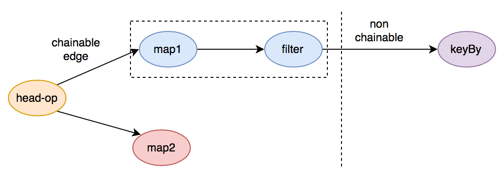
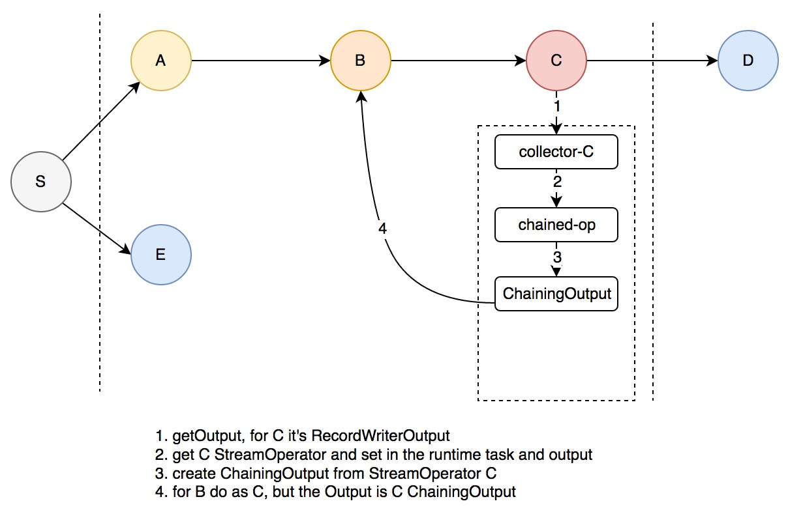
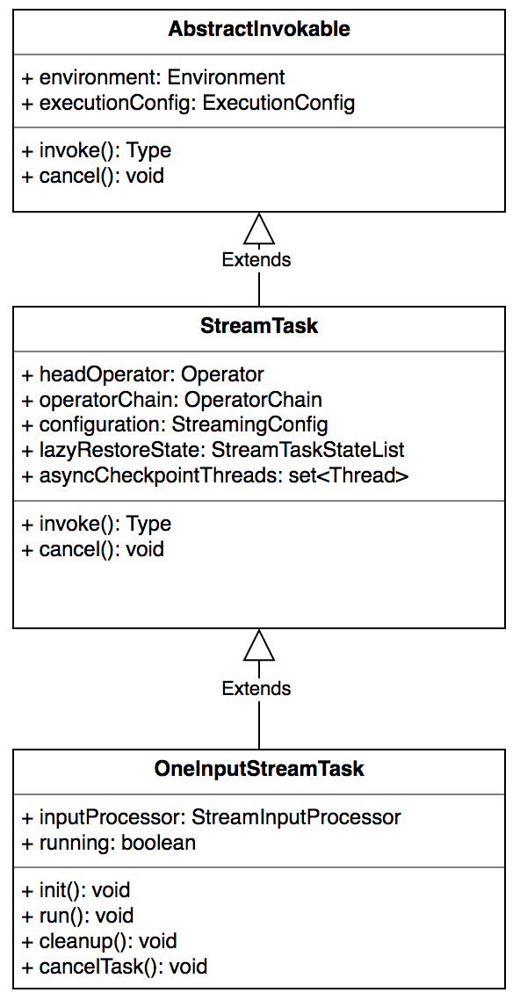

# Flink算子的生命周期

## 前言

前面已经介绍了 flink 的逻辑计划、物理计划等相关信息，本文将重点介绍 flink 的 operator 以及运行时的 task，后续会介绍 flink task 的调度算法

## 算子

### 什么是一个算子

flink 中的一个 operator 代表一个最顶级的 api 接口，拿 streaming 来说就是，在 DataStream 上做诸如 map/reduce/keyBy 等操作均会生成一个算子

### 算子的生成

先来看 operator 的继承关系:

对于 Streaming 来说所有的算子都继承自 StreamOperator，StreamOperator 中定义了一系列的生命周期方法，同时也定义了 snapshort 的接口，AbstractStreamOperator 定义了基本的设置和声明周期方法，AbstractUdfStreamOperator 定义了用户自定义函数的生命周期和快照策略，这些接口的调用时机会在下面一一阐述😄。

算子的生成触发于对 DataStream 的操作上，比如 map addSink等。

### 算子 chain

在 **flink 基本组件和逻辑计划生成一节** 我们介绍了 JobGraph 的生成过程，其中 JobGraph 的生成最大的意义在于做了一些算子的 chain 优化，那么什么样的节点可以被 chain 呢？如下图：



一些必须要经过 shuffle 的节点是 chain 或者 节点可达 的边界，非常类似于 Spark Streaming 中对于 Stage 的划分，上图中 keyBy 这样的 groupBy 操作就是划分是否可被 chain 的边界

在 StreamingJobGraphGenerator 的 createChain 方法中为每个 StreamNode 生成了一个 StreamConfig，并且对于可以生成 JobVertex 的节点[ *chain 的起始节点* ]设置了如下属性：

```java
//StreamingJobGraphGenerator line212
if (currentNodeId.equals(startNodeId)) {

   config.setChainStart();
   config.setChainIndex(0);
   config.setOutEdgesInOrder(transitiveOutEdges);
   config.setOutEdges(streamGraph.getStreamNode(currentNodeId).getOutEdges());

   for (StreamEdge edge : transitiveOutEdges) {
      connect(startNodeId, edge);
   }

   config.setTransitiveChainedTaskConfigs(chainedConfigs.get(startNodeId));

}
```

上面的逻辑概括如下：

- 标志本节点为 chain 的起始位置
- 设置 chain 的索引
- 设置可达输出边，就是与下游 JobVertex 直接连接的 StreamEdge
- 设置自身的直接输出边 StreamEdge
- 将本 JobVertex 与下游的 JobVertex 连接起来
- 将被 chained 的可达的下游 StreamNode 的配置一同设置进本 JobVertex 的配置中，后面 task 运行时会用到

连接的逻辑如下：

```java
//StreamingJobGraphGenerator line357
private void connect(Integer headOfChain, StreamEdge edge) {

   physicalEdgesInOrder.add(edge);

   Integer downStreamvertexID = edge.getTargetId();

   JobVertex headVertex = jobVertices.get(headOfChain);
   JobVertex downStreamVertex = jobVertices.get(downStreamvertexID);

   StreamConfig downStreamConfig = new StreamConfig(downStreamVertex.getConfiguration());

   downStreamConfig.setNumberOfInputs(downStreamConfig.getNumberOfInputs() + 1);

   StreamPartitioner<?> partitioner = edge.getPartitioner();
   if (partitioner instanceof ForwardPartitioner) {
      downStreamVertex.connectNewDataSetAsInput(
         headVertex,
         DistributionPattern.POINTWISE,
         ResultPartitionType.PIPELINED,
         true);
   } else if (partitioner instanceof RescalePartitioner){
      downStreamVertex.connectNewDataSetAsInput(
         headVertex,
         DistributionPattern.POINTWISE,
         ResultPartitionType.PIPELINED,
         true);
   } else {
      downStreamVertex.connectNewDataSetAsInput(
            headVertex,
            DistributionPattern.ALL_TO_ALL,
            ResultPartitionType.PIPELINED,
            true);
   }

   if (LOG.isDebugEnabled()) {
      LOG.debug("CONNECTED: {} - {} -> {}", partitioner.getClass().getSimpleName(),
            headOfChain, downStreamvertexID);
   }
}
```

概括下逻辑：

* 获取要连接的两个 JobVertex 对象
* 设置下游 JobVertex 的输入 partition 算法，如果是 forward 或 rescale 的话为 POINTWISE，否则为全连接，也就是 shuffle，POINTWISE 的连接算法在 **flink 物理计划生成** 一节已经介绍，这里不再赘述

*以上只是客户端生成逻辑计划时的算子 chain，在运行时算子的的 chain 被封装成了一个单独的对象 OperatorChain，里面在原有的基础上将 operators 的操作封装起来并且确定了下游的的输出入口*

来看 OperatorChain 的核心实现

首先总结下构造器的功能:

* 获取可达的 chain 的 StreamNode 配置
* 为直接可达的输出 StreamEdge 分别创建一个 Output，这里为 RecordWriterOutput
* 创建chain的入口
* 如果创建有任何失败，释放掉 RecordWriterOutput 占用的资源，主要是内存 buffer，后面章节会介绍

这里的关键是算子 chain 的创建过程，见下图创建过程：



上图中 S 节点的下游 A/B/C 是可以与 S Chain 在一起的，D/E 是必须经过网络传输的节点，一个 OperatorChain 封装了图中的节点 S/A/B/C，也就是说上图可以被看做如下所示：


OperatorChain 中有两个关键的方法：`createOutputCollector` 和 `createChainedOperator`，前者负责获取一个 StreamNode 的输出Output，后者负责创建 StreamNode 对应的 chain 算子，两者相互调用形成递归，如上面的创建过程图，具体的流程如下：

* 创建 S 的所有网络输出 RecordWriterOutput，这里会为 D 和 E 分别创建一个
* 由于从 A 开始对于 S 是可被 chain 的，会递归创建从 C 开始
* 先获取 C 的输出，这里为对应 D 的 RecordWriterOutput
* 拿到 C 对应的 StreamOperator 并将 运行时的 StreamTask 和 Output 设置进去
* 将 StreamOperator 封装成 ChainingOutput 并作为 Output 传给 B
* B 将重复 C 的过程，直到 S/A/B/C 全部被创建

*那么 S 发射一条消息后的处理流程是如何呢？*

S 在调用 `processElement` 方法时会调用 `output.collect`，这里的 output 为 A 对应的 ChainingOutput，ChainingOutput 的 collect 调用了对应的算子 `StreamOperator A` 的 `processElement` 方法，这里又会调用 B 的 ChainingOutput 的 collect 方法，以此类推。这样便实现了可 chain 算子的本地处理，最终经由网络输出 RecordWriterOutput 发送到下游节点

### 算子的运行

flink 算子的运行牵涉到两个关键类 `Task.java` 和 `StreamTask.java`，Task 是直接受 TaskManager 管理和调度的，而 Task 又会调用 StreamTask，StreamTask 中封装了算子的处理逻辑

**我们先来看 StreamTask**

StreamTask 的 JavaDoc 上描述了其生命周期:

```java
*  -- restoreState() -> restores state of all operators in the chain
*  
*  -- invoke()
*        |
*        +----> Create basic utils (config, etc) and load the chain of operators
*        +----> operators.setup()
*        +----> task specific init()
*        +----> open-operators()
*        +----> run()
*        +----> close-operators()
*        +----> dispose-operators()
*        +----> common cleanup
*        +----> task specific cleanup()
```

StreamTask 运行之初会尝试恢复算子的 State 快照，然后由 Task 调用其 invoke 方法

下面重点分析一下其 invoke 方法的实现

- 获取 headOperator，这里的 headOperator 在 StreamingJobGraphGenerator line 210 `setVertexConfig(currentNodeId, config, chainableOutputs, nonChainableOutputs);`设置，对应上面算子 chain 中的 S 节点
- 创建 operatorChain 并设置为 headOperator 的 Output
- `init()`
- `restoreState`
- 执行 operatorChain 中所有 operator 的 open 方法
- `run()`
- 执行 operatorChain 中所有 operator 的 close 方法
- 执行资源回收及 `cleanup()`，最主要的目的是回收内存 buffer

StreamTask 中还有关于 Checkpoint 和 StateBackup 的核心逻辑，这里先不介绍，会另开一篇😄

我们来看 StreamTask 的实现类之一 OneInputStreamTask ，便可以知道 `init()` 和 `run()` 分别都做了什么：

**init方法**：

- 获取算子对应的输入序列化器 TypeSerializer
- 获取输入数据 InputGate[]，InputGate 是 flink 网络传输的核心抽象之一，其在内部封装了消息的接收和内存的管理，后面介绍 flink 网络栈的时候会详细介绍，这里只要了解从 InputGate 可以拿到上游传送过来的数据就可以了
- 初始化 StreamInputProcessor
- 设置一些 metrics 及 累加器

StreamInputProcessor 是 StreamTask 内部用来处理 Record 的组件，里面封装了外部 IO 逻辑【*内存不够时将 buffer 吐到磁盘上*】以及 时间对齐逻辑【*Watermark*】，这两个将会合并一节在下一章介绍^_^

**run方法**:

- 从 StreamInputProcessor 中处理一条记录
- check 是否有异常

**真正的运行时类 Task**

 *这里我们会详细的介绍下 Task 的核心逻辑*

Task 代表一个 TaskManager 中所起的并行 子任务，执行封装的 flink 算子并运行，提供以下服务：消费输入data、生产 IntermediateResultPartition [ *flink关于中间结果的抽象* ]、与 JobManager 交互

JobManager 分发 Task 时最初是抽象成了一个描述类 TaskDeploymentDescriptor，TaskManager 在抽到对应的 RPC 请求后会将 Task 初始化后将 线程 拉起，TaskDeploymentDescriptor 是提供 task 信息的核心抽象：

- ResultPartitions：task 输出的 partition 数[ *通常和 JobVertex 的下游节点数对应*  ]
- InputGates：task 的输入中间结果 partition
- operator-state：算子的状态句柄，由 TaskManager 上报给 JobManager，并统一维护
- jar-files
- class-paths

构造器的一些组件我们会在介绍 TaskManager 的时候再详述

其核心的运行方法 run()逻辑总结如下：

line408: run

- 核心的运行逻辑
- line429: 遇到错误后通知 TaskManager
- line469: 从 NetworkEnvironment 中申请 BufferPool，包括 InputGate 的接收 pool 以及 task 的每个 ResultPartition 的输出 pool，申请的资源数[ *num of Buffer* ] 由 input channels 和 ResultSubPartition 数决定

关于网络管理[ 输入和输出 ] NetworkEnvironment，内存管理 MemoryManager 会分别开章节介绍

那么 StreamTask 是如何在 Task 中被实例化，又是如何被调用的呢？

```java
//line 418
invokable = loadAndInstantiateInvokable(userCodeClassLoader, nameOfInvokableClass);
//一系列初始化操作 ...
//line 584
invokable.invoke();
```

上面的 invokable 就是 StreamTask，StreamTask  的继承关系:



那么具体是什么时候被 set 进去作为属性的呢？

在 StreamNode 生成的时候有这样一段逻辑:

```java
public <IN, OUT> void addOperator(
      Integer vertexID,
      String slotSharingGroup,
      StreamOperator<OUT> operatorObject,
      TypeInformation<IN> inTypeInfo,
      TypeInformation<OUT> outTypeInfo,
      String operatorName) {

   if (operatorObject instanceof StoppableStreamSource) {
      addNode(vertexID, slotSharingGroup, StoppableSourceStreamTask.class, operatorObject, operatorName);
   } else if (operatorObject instanceof StreamSource) {
      addNode(vertexID, slotSharingGroup, SourceStreamTask.class, operatorObject, operatorName);
   } else {
      addNode(vertexID, slotSharingGroup, OneInputStreamTask.class, operatorObject, operatorName);
   }
```

将 OneInputStreamTask 等 StreamTask 设置到 StreamNode 的节点属性中，同时在 JobVertex 的节点构造时也会做一次初始化:

```java
jobVertex.setInvokableClass(streamNode.getJobVertexClass());
```

在 TaskDeploymentDescriptor 实例化的时候会获取 jobVertex 中的属性，见`ExecutionVertex line673`

#### 算子初始化

那么算子是什么时候被初始化的呢？这就需要梳理下 StreamTask 的 `init()` 方法的处理时机，上面已经分析过 `init()` 方法会在 StreamTask 的 `invoke()` 方法中被调用，那么 `invoke()` 方法又是何时被调用的呢？这就涉及到另外一个重要的类 Task.java，Task 才是运行时真正直接被 TaskManager 实例化和调用的类，上面已经分析过 Task 的 run 方法，是 TaskManager 收到 rpc 命令后起起来的 具体的细节会另起一章 flink 任务分发

#### 算子销毁

StreamTask 下执行完 invoke 方法之后[*意味着流程正常结束或者有异常打断*]，会执行下面这段逻辑:

```java
/**
 * Execute the operator-specific {@link StreamOperator#dispose()} method in each
 * of the operators in the chain of this {@link StreamTask}. </b> Disposing happens
 * from <b>tail to head</b> operator in the chain.
 */
private void tryDisposeAllOperators() throws Exception {
   for (StreamOperator<?> operator : operatorChain.getAllOperators()) {
      if (operator != null) {
         operator.dispose();
      }
   }
}
```

所以，算子中有任何 hook 函数或者必须执行的销毁工作可以写在 dispose 方法里，这段逻辑是 flink 保证一定可以执行到的