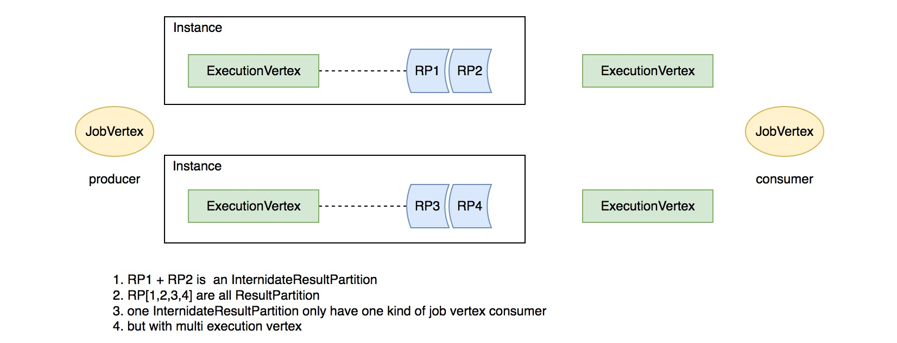
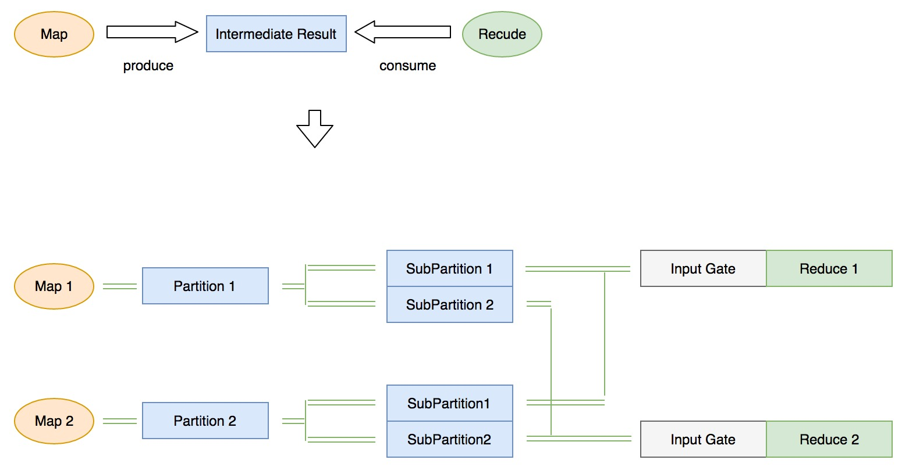
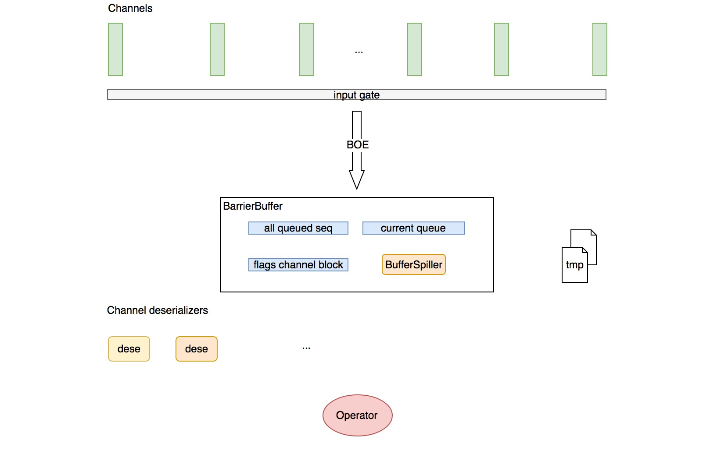
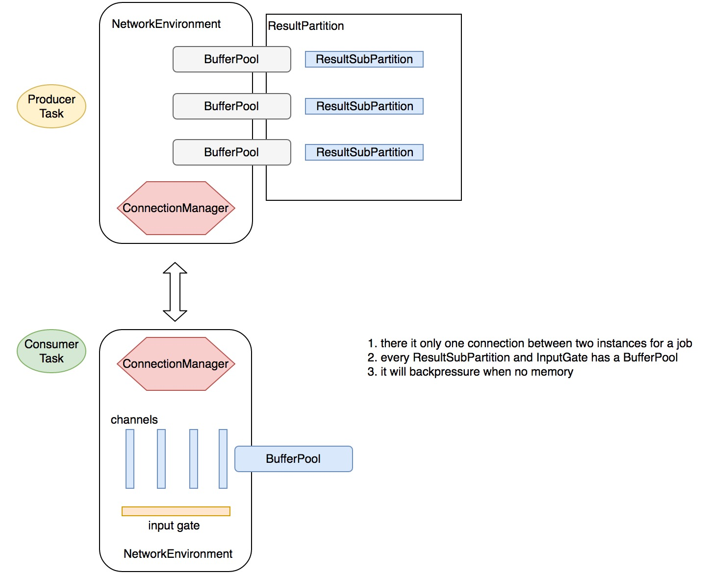

# Flink网络栈

本章节主要介绍 flink 的网络交互，包括每个 task 的输入输出管理，内存分配和释放等，因为涉及到内存申请，这里会介绍 flink 的内存管理

*我们会从 flink 网络相关的核心抽象开始介绍*

## IntermediateResult

代表一个 Job Vertex 的中间执行结果，由于同一个 Job vertex 可能有多个线程并发执行，这里的 IntermediateResult 对应一个 Job Edge 的输出下游结果集，一个 IntermediateResult 包含多个 IntermediateResultPartition，一个 IntermediateResultPartition 对应一个并行任务 ExecutionVertex 的输出结果，如下图所示：

 *对应关系如下*：

- IntermediateDataSet [StreamGraph] <-> IntermediateResult[JobGraph]  代表一个 dataset
- IntermediateResultPartition [ExecutionGraph] 代表一个并行任务的输出 partition 
- ResultPartition 代表一个  IntermediateResultPartition 的生产者 ExecutionVertex 的输出 副本，可输出多个副本
- 一个 ResultPartition 可能包含多个 ResultSubPartition【依据下游消费 task 的数目】


下面介绍数据的消费*


## InputGate

InputGate 是 flink 关于 task 的一个输入源的抽象，一个 InputGate 代表一个上游数据源，对应**一个**上游中间结果的一个或多个 partition

flink 依据中间结果的 producer 【*生产task*】的并发度来生成相应个数的 partition，每个 producer task 生产一个 partition，为了优化并发读写，flink 依据中间结果的消费者 task 的并发度进一步将每个 partition 划分为多个 subPartition，假设有如下这样的一个简单地生产消费模型：



上图的模型包含了一个生产者任务 map() 和消费者任务 reduce()，两者的并行度都是 2，由于有两个 producer task，这时候 flink 会将中间结果划分为两个 partition，同时由于有 2 个 consumer task，每个 partition被进一步划分为两个 sub partiton

对于每个 consumer task，flink 会维护一个消费的中间数据集和 task 本身的对应关系，这就是 InputGate

每个 InputGate 会维护消费一个中间结果的每个partition中的一个 subPartition，这样的一个 subPartition 的消费需要建立一个 InputChannel

ps: 目前 flink 的一个中间结果 partition 仅支持一个 consumer 节点【JobVertex】

### InputGate的创建

在上一节 Flink 算子的声明周期一节，我们介绍了 Flink 的 Instance 直接执行类 Task.java，在其构造器中有这样一段逻辑：

```java
// Consumed intermediate result partitions
		this.inputGates = new SingleInputGate[consumedPartitions.size()];
		this.inputGatesById = new HashMap<IntermediateDataSetID, SingleInputGate>();

		for (int i = 0; i < this.inputGates.length; i++) {
			SingleInputGate gate = SingleInputGate.create(
					taskNameWithSubtaskAndId, jobId, executionId, consumedPartitions.get(i), networkEnvironment, 
					metricGroup.getIOMetricGroup());

			this.inputGates[i] = gate;
			inputGatesById.put(gate.getConsumedResultId(), gate);
		}
```

这里直接用的 SingleInputGate，而 SingleInputGate 有是如何去建立和上游 ResultSubPartition 的连接关系的呢？SingleInputGate 在初始化的时候利用了关键的的参数 InputGateDeploymentDescriptor，其中包含了 partition 的一些关键信息，具体见 `SingleInputGate line 502`，这里列一下初始化过程：

- 从 InputGateDeploymentDescriptor 中获取 IntermediateDataSetID、consumedSubpartitionIndex

  、InputChannelDeploymentDescriptor

- IntermediateDataSetID 告知了消费的数据集，consumedSubpartitionIndex 告知了每个 ResultPartition 要消费的 ResultSubPartition 的索引，InputChannelDeploymentDescriptor 中告知了每个要消费的 ResultPartition 的 id 和 location 信息

这样 InputGate 便知道从哪里消费 partition 以及 partition 的连接信息【本地 or 远程】

### 注册 BufferPool

在 NetworkEnvironment 注册 Task 的时候会为每个 task 的每个 InputGate 申请一个 BufferPool：

```java
//NetworkEnvironment line323
for (SingleInputGate gate : inputGates) {
				BufferPool bufferPool = null;

				try {
					bufferPool = networkBufferPool.createBufferPool(gate.getNumberOfInputChannels(), false);
					gate.setBufferPool(bufferPool);
				}
				catch (Throwable t) {
					if (bufferPool != null) {
						bufferPool.lazyDestroy();
					}
```

BufferPool 的最小大小为 input channel 的个数！

### InputChannel

和上游的一个 ResultSubPartition 的连接叫做一个 InputChannel，InputChannel 一共分为三种: LocalInputChannel、RemoteInputChannel、UnknownInputChannel，分别表示一个本地连接，远程连接以及需要运行时确立的连接

### InputGateDeploymentDescriptor

上面我们提到，SingleInputGate 在初始化的时候用到了关键信息主要由 InputGateDeploymentDescriptor 来提供，那么 InputGateDeploymentDescriptor 是如何生成的呢？规则是什么？

在 Task 实例化的时候有一个关键的描述对象参数：TaskDeploymentDescriptor，其中包含了 task 运行时需要的 jar 包路径，配置等重要信息，其中一个关键信息便是：InputGateDeploymentDescriptor，而 Task 是 TaskManager 负责启动的，TaskManager 接收了 JobManager 的 RPC 命令，提交作业，具体的生成首先会牵涉到 Flink 的调度，这里会简单介绍下，细节会另开一节专门介绍

前面章节中，我们介绍运行时，一个并发 Task 被抽象为 ExecutionVertex，而一次执行被抽象为 Execution，在 Execution 中有负责获取资源和调度的接口：

```java
//Execution.java line265
public boolean scheduleForExecution(Scheduler scheduler, boolean queued) throws NoResourceAvailableException
```

Execution 通过 Flink 的核心调度器 [ 目前也是唯一一个 ] 先获取一个 Slot [ SimpleSlot/ flink 对资源的抽象，在调度章节会详细介绍 ]，后将 Task 部署到该 Slot 上，而 TaskDeploymentDescriptor 就在部署前被创建：

```java
//Execution.java line 370
final TaskDeploymentDescriptor deployment = vertex.createDeploymentDescriptor(
	attemptId,
	slot,
	operatorState,
	operatorKvState,
	attemptNumber);
```

具体的规则见 ExecutionVertex `line 636: createDeploymentDescriptor`，这里简单分析下：

- 依据要输出的 IntermediateResultPartition 生成对应的 ResultPartition 实例
- 对每个上游的 JobVertex 生成一个 InputChannelDeploymentDescriptor 数组用来实例化一个 InputGateDeploymentDescriptor
- 获取额外配置

#### InputGateDeploymentDescriptor的生成规则

- InputGateDeploymentDescriptor line 87
- 对于每个上游输入边 ExecutionEdge 获取其生产者 ExecutionVertex
- 获取 ExecutionVertex 的执行状态，如果是 RUNNING 或 FINISHED，判断生产者的 slot 和本 task 即将部署的 slot 是否在一个 Instance，生成相应的 Location 抽象： ResultPartitionLocation
- 如果不是  RUNNING 或 FINISHED 状态，生成未知 Location
- 一个 ExecutionEdge 实例化一个 InputGateDeploymentDescriptor ，一个 InputGateDeploymentDescripto 会同时消费上游每个生产者 ExecutionVertex 的固定 index 的 sub partition


## InputProcessor

对于每个 task，flink 都会生成一个 InputProcessor，具体就是 StreamIputProcessor。StreamIputProcessor 干了两件事情：

- 消息解序列化并交由算子处理
- 追踪 Watermark Event 并分发时间对齐事件

*时间 对齐会专门起一章讲解，这里只介绍 消息序列化 ^_^*

Flink 将消息的序列化抽象为两个模块：

- 内存申请和流数据读取：由 SpillingAdaptiveSpanningRecordDeserializer 负责，从名字就可以大致了解其会动态吐磁盘【当内存不够的时候】
- 解序列化：由 NonReusingDeserializationDelegate 负责


NonReusingDeserializationDelegate 包含一个 serializer，依据是否需要发射水印区分为 MultiplexingStreamRecordSerializer 和 StreamRecordSerializer，这两个 serializer 只是在 TypeSerializer 上做了一层封装，这里就不做介绍了【TypeSerializer 是类型系统的重要组成，如果有时间的话我会单独开一章节介绍 flink 的类型系统】

这里重点讲一下流数据的读取部分，也就是  SpillingAdaptiveSpanningRecordDeserializer
###SpillingAdaptiveSpanningRecordDeserializer
*每个 channel 都有一个 SpillingAdaptiveSpanningRecordDeserializer*

前面提到，SpillingAdaptiveSpanningRecordDeserializer 主要负责流数据的读取，同时通过 NonReusingDeserializationDelegate 来解序列化，从而获得可以发送给算子处理的 StreamElement。SpillingAdaptiveSpanningRecordDeserializer 内部有两个实现类：NonSpanningWrapper 和 SpanningWrapper，前者将数据存储进内存，后者存储前者存不下的部分内存数据以及将超量数据吐到磁盘。我们来解释下其核心方法：

####添加 Buffer

添加 Buffer 会首先 check spanningWrapper 中是否已有数据，如果有，说明 nonSpanningWrapper 中的数据已满，会继续走 spanningWrapper 添加数据，否则走 nonSpanningWrapper 添加数据。

```java
@Override
	public void setNextMemorySegment(MemorySegment segment, int numBytes) throws IOException {
		// check if some spanning record deserialization is pending
		if (this.spanningWrapper.getNumGatheredBytes() > 0) {
			this.spanningWrapper.addNextChunkFromMemorySegment(segment, numBytes);
		}
		else {
			this.nonSpanningWrapper.initializeFromMemorySegment(segment, 0, numBytes);
		}
	}
```

####读取 Record

```java
//SpillingAdaptiveSpanningRecordDeserializer line98
@Override
	public DeserializationResult getNextRecord(T target) throws IOException {
		// always check the non-spanning wrapper first.
		// this should be the majority of the cases for small records
		// for large records, this portion of the work is very small in comparison anyways
		
		int nonSpanningRemaining = this.nonSpanningWrapper.remaining();
		
		// check if we can get a full length;
		if (nonSpanningRemaining >= 4) {
			int len = this.nonSpanningWrapper.readInt();
```

简单总结：

- 先判断 nonSpanningWrapper 中有没有记录，如果有优先读取并返回解序列化的类型，其中有两个特例，一是 Record 长度过大，超出了 nonSpanningWrapper 中的 Buffer 的剩余内存，这时候将 nonSpanningWrapper 的数据托管给 spanningWrapper，二是 record 的长度数据不全，这时候也是采取托管给 spanningWrapper 的策略
- 如果 nonSpanningWrapper  没有记录，判断 spanningWrapper 是否有完全记录，有的话读取，并将 spanningWrapper 中的不完全 buffer 托管给 nonSpanningWrapper
- 除了个别超大的 record ，对于流式计算来说，大部分走的都应该是 nonSpanningWrapper，之所以设计了 spanningWrapper，主要是为了适应超大的 Record

### 处理输入

我们回来 InputProcessor

上面提到了 nonSpanningWrapper 或 spanningWrapper 都是从 buffer 中读取数据的，那么这个 buffer 是如何写入的呢？

答案是通过 BarrierHandler 写入

这里涉及到了 flink 的 checkpoint 机制，会在下一节详细介绍，这里只介绍 Buffer 内存的获取

处理输入的核心逻辑：

```java
//StreamInputProcessor line134
public boolean processInput(OneInputStreamOperator<IN, ?> streamOperator, final Object lock) throws Exception {
		if (isFinished) {
			return false;
		}
		if (numRecordsIn == null) {
			numRecordsIn = streamOperator.getMetricGroup().counter("numRecordsIn");
		}
```

这里简要概括：

- 第一次进方法的时候，currentRecordDeserializer 为空，通过 barrierHandler 来协调当前读取的 channel 索引和获取数据流 Buffer
- 以后 currentRecordDeserializer 的消费以 Buffer 为单位，Buffer 消费完会转换下一个 channel 继续消费

*这里的关键是 barrierHandler BufferOrEvent 事件的获取，我们向上追溯*

依据消费语义的不同，barrierHandler 有两种：

- BarrierBuffer 对应 exactly_once 语义【有 checkpoint】
- BarrierTracker 对应 at_least_once 语义

*我们先来看 BarrierBuffer*

#### BarrierBuffer

##### BufferSpiller

BufferSpiller 消费 buffer 和 event 事件流并吐到磁盘文件，在写一定数量的流数据后，可以执行 rollOver 操作：将磁盘数据以 sequence 的方式暴露出来，同时创建新的磁盘文件以备下次读写。由于读写操作间隔很短，文件本身也不是很大，大部分读写操作都会在 ms 级别完成。

##### 获取 BufferOrEvent

*以下简称 BufferOrEvent 为 boe*

核心逻辑在 getNextNonBlocked方法中:

```java
//BarrierBuffer line103
public BufferOrEvent getNextNonBlocked() throws IOException, InterruptedException {
		while (true) {
			// process buffered BufferOrEvents before grabbing new ones
			BufferOrEvent next;
			if (currentBuffered == null) {
				next = inputGate.getNextBufferOrEvent();
			}
```

简单总结：

- 如果当前没有堆积的 boe，直接从 InputGate 中获取，否则从缓存中获取【通过BufferSpiller缓存的数据】
- 如果是从堆积中获取 boe，并且来自一个被 block 的 channel，再次将 boe 通过 BufferSpiller 写入缓存
- 如果是该 boe 是消息 Buffer，返回；如果是 Checkpoint Event，处理 Barrier 事件
- 如果获取到某个 channel 的 Partition 消费结束事件或获取不到消息，取消 block 所有的 channel，并继续读取缓存中的数据，如果最后缓存中的数据也消费完了，返回 null

*那么处理 barrier 的逻辑是怎样的呢？*

##### 处理 Barrier

处理 barrier 的核心逻辑在 processBarrier 方法中:

```java
//BarrierBuffer line161
private void processBarrier(CheckpointBarrier receivedBarrier, int channelIndex) throws IOException {
		final long barrierId = receivedBarrier.getId();

		if (numBarriersReceived > 0) {
			// subsequent barrier of a checkpoint.
			if (barrierId == currentCheckpointId) {
				// regular case
				onBarrier(channelIndex);
			}
```

简单总结：

- 如果当前的 Barrier 事件的 id 与当前 checkpointId 相等，则 block 该 boe 的源 channel，并增加 numBarriersReceived 计数
- 如果 Barrier 事件的 id 大于 checkpointId，取消 block 所有的 channels，并更新当前 checkpointId 为该 id 并且阻断对应的 channel
- 如果 numBarriersReceived 加上 已经关闭的 channel 数等于 channel 的总数，进行 checkpoint，并取消 block 所有的 channel

这里补张图说明数据的消费过程:



在一轮 barrier 过程中，flink 接收每个 channel 的 barrier event，获取其 barrier id 与此轮之前最大的 id：checkpoint id 作比较：如果相等，则 block 对应的 channel，被 block 的 channel 在此轮中的数据会通过 BufferSpiller 吐到磁盘【大部分情况是 page cache】；如果大于 checkpoint id，会提升 checkpoint id 为此 id，并取消 block 所有的 channel，直接进入下一轮 barrier；如果小于，直接丢弃此事件；如果此轮所有的 channel 都发送了一致的 id，则以此 id 进行 checkpoint，并取消所有的 channel block

值得注意的是，每次取消所有的 channel block 都会将 BufferSpiller 中的数据暴露成 buffer sequence 并加入队列中，下次获取记录时会优先取 sequence 中的数据

列举几种典型的数据流向：

- input-gate -> operator：消费顺畅，一轮无任何阻塞
- input-gate -> BufferSpiller -> current-queue -> operator：相对于其它 channel，消费过快，此轮被吐到磁盘，下一轮再消费
- current-queue -> operator：相对于其它 channel，消费过慢，被吐到磁盘，下一轮再消费


*下面介绍数据的生产*


## RecordWriterOutput

在 flink 算子的声明周期一节我们介绍过：算子通过 RecordWriterOutput 将处理过的 record 写出去，下面我们来分析其行为

RecordWriterOutput 实现了接口 Output，具备以下功能接口：

- collect：发射 record
- emitWatermark：广播 watermark 到每个输出 channel
- broadcastEvent：广播 Barrier Event 到每个输出 channel

它的内部维护了一个序列化器和真正的 RecordWriter【这里是 StreamRecordWriter】，我们来稍微分析下它们

### SpanningRecordSerializer

实现比较简单，将输入的 record 序列化并连同长度信息一同写入内存 Buffer

### RecordWriter

recordWriter 维护了运行时的 ResultPartitionWriter【真正写 ResultSubPartition】，将 record 序列化进内存 Buffer，来看它的构造器：

- 传入 ResultPartitionWriter
- 传入 channelSelector【不同的 partition 方式有不同的 selector，如 forward、shuffle 等】
- 为每一个写 channel 实例化一个 SpanningRecordSerializer

*下面介绍其核心接口*

#### 发射 record

对应方法 emit，核心逻辑概括：

- 通过  channelSelector 选择要输出的 channel id
- 找到对应的 SpanningRecordSerializer 并通过其序列化
- 有三种情况：record 小于 Buffer 大小、record 等于 Buffer 大小、record 大于【准确的说应该加上长度信息的4个字节】，分别对应三种不同的序列化返回结果，这里有一个细节需要特别注意，写 record 的 Buffer 是写死的 128 bytes 长度，长度不够时会 resize 其大小，所以消息是不会丢失的
- 如果以上的前两种情况满足意味着消息被完整序列化并写入内存 Buffer，此时通过 ResultPartitionWriter 将包含序列化数据的 Buffer 写出去
- 同时为 SpanningRecordSerializer 向 NetworkeEnvironment 申请的 BufferPool 再次申请新 Buffer【见 TaskManager 基本组件】

###### 生产端反压

细心的童鞋会发现，在每个发送的接口里，用来解析序列化消息的内存 Buffer 申请都走了这样一个逻辑 `writer.getBufferProvider().requestBufferBlocking()`

这段逻辑是阻塞操作，对应每个 ResultPartition 来说，其 BufferPool 是有限大小的，当内存不足时会阻塞，并停止继续解析消息！

#### 广播 Barrier 事件

逻辑与发射 Record 类似，稍有不同：

- 对于每个要广播的 channel，如果有残留在内存 Buffer 的数据，先通过 ResultPartitionWriter 写出去，再写 Barrier 事件
- 申请内存逻辑类似

### ResultPartitionWriter

上面介绍过 ResultPartitionWriter 是执行了序列化后 Record 的写操作，其实它是消息的路由器，具体写是通过 ResultPartition 来完成的

### ResultPartition

*先翻译下官方的 java doc：*

一个 ResultPartition 是单个 task 的输出结果，在运行时，它是逻辑概念 IntermediateResultPartition 的一部分。ResultPartition 是一个 Buffer 的集合，并且以 ResultSubpartition 的形式进行组织，而 ResultSubPartiton 的个数等同于下游 consumer task 的个数，具体写入到哪个 ResultSubpartition 由 DistributionPattern 【上面说的 channel selector】来决定。

关于生命周期：一个 ResultPartition 有三个阶段：

- Produce
- Consume
- Release

关于 consumer tasks 的延迟部署和更新：

- 依据 ResultPartition 的类型：PIPELINED 和 BLOCKING 对应两种部署模式，分别对应流式计算和批处理
- 对于 PIPELINED 类型，consumer tasks 在 ResultPartiton 产生第一个结果 Buffer 的时候会立即部署
- 对于 BLOCKING 类型，consumer tasks 在 ResultPartiton 结束后才会部署

观察 `line162  ` 可知如果是 PIPELINED 类型，ResultSubPartition 的类型为：PipelinedSubpartition

我们来分析下它的核心接口：

#### 注册 BufferPool

代码见 `line187 registerBufferPool` 方法，此 BufferPool 为 TaskManager 在运行 task 时 通过 NetworkEnvironment 注册进来的。如果是 BLOCKING 类型，这里会注册 BufferPool 的 owner 为此 ResultPartiton，NetworkEnvironment 如果出现内存不足的情况，会通过 ResultPartiton 的引用，以 Sub Partiton 为单位将内存释放掉【见 TaskManager 基本组件 NetworkEnvironment】。

既然注册 BufferPool 是以 task 为单位的，那么每个 task 会拥有几个 BufferPool， BufferPool 的大小又是多少呢？在 NetworkEnvironment 中有这样一段逻辑：

```java
//NetworkEnvironment line297
try {
					bufferPool = networkBufferPool.createBufferPool(partition.getNumberOfSubpartitions(), false);
					partition.registerBufferPool(bufferPool);

					partitionManager.registerResultPartition(partition);
				}
```

其中的 `partition.getNumberOfSubpartitions()` 是 ResultPartition 的 sub partition 的个数，我们可以看到，一个 task 拥有的 BufferPool 个数等于它产生的 ResultPartition 的个数，一个 ResultPartition 对应一个 BufferPool，而每个 BufferPool 的最小大小等于它的 sub partition 的个数【consumer task 的个数】。为什么说是最小大小，见 TaskManager 基本组件 NetworkEnvironment。

#### 写入 Buffer

```java
// ResultPartition line244
public void add(Buffer buffer, int subpartitionIndex) throws IOException {
		boolean success = false;

		try {
			checkInProduceState();
```

简单总结：

- 找到对应的 ResultSubPartition 并写入 Buffer
- 如果是第一次写入，并且是 PIPELINED 类型，通知 JobManager 可以部署下游 consumer，具体细节将会在 调度一章专门讲解
- 如果写入失败，回收内存 Buffer

#### ResultSubpatition

这里我们只介绍 PipelinedSubpartition，实现比较简单，就不具体介绍了，有一点需要注意，就是 NotificationListener

每次 ResultSubpatition 的状态有变动【被写入，被释放，写入完成等】都会通知 NotificationListener，通知完之后就会销毁 NotificationListener 的注册

*典型的我们详细分析下 add Buffer 后通过 NotificationListener 触发的一些列行为*

PipelinedSubPartition 在添加一个 Buffer 后，如果 NotificationListener 不为 null，那么会通知 NotificationListener，NotificationListener 共有两个实现类 LocalInputChannel 和 SequenceNumberingSubpartitionView，分别对应本地传输和网络传输。

#### 与 InputChannel 的交互

在 consumer task 向 SingleInputGate 请求 Buffer 时，会先触发 requestPartitions 操作，不同的 channel 会触发不同的行为:

- 对于 LocalInputChannel 来说就是获取 ResultSubPartitonView 并将自己注册到对应的 ResultSubPartition 中
- 对于 RemoteInputChannel 会触发 netty 连接并开始请求队列数据

*我们先来看 LocalInputChannel*

##### LocalInputChannel

LocalInputChannel 在收到通知后，发生以下行为：

- check ResultSubPartitonView 中有无数据，如果有的话通知 SingleInputGate，并将自己【LocalInputChannel】加入到 SingleInputGate 的有数据 channel 队列中
- 如果没有数据，将自己重新注册到对应的 ResultSubPartition 中

*再来看SequenceNumberingSubpartitionView，不过在这之前先介绍 RemoteInputChannel*

##### RemoteInputChannel

上面提到 RemoteInputChannel 在 SingleInputGate 第一次执行获取 Buffer 的逻辑时，会触发 RemoteInputChannel 的网络连接，具体逻辑如下：

```java
//RemoteInputChannel line114
@Override
void requestSubpartition(int subpartitionIndex) throws IOException, InterruptedException {
		if (partitionRequestClient == null) {
			// Create a client and request the partition
			partitionRequestClient = connectionManager
					.createPartitionRequestClient(connectionId);

			partitionRequestClient.requestSubpartition(partitionId, subpartitionIndex, this, 0);
		}
	}
```

这一段先会创建 netty 连接，然后会请求 netty 数据，下面我们详细分析 flink 关于 netty 连接的抽象

## Netty 连接

flink 采用 netty 作为底层的网络传输框架，各个 Instance 之间会依照消费依赖建立一个 Netty 连接，然后通过 NetworkEnvironment 管理数据的消费，本人对 Netty 研究的不是很精，这里只站在 flink 的角度梳理一些重点的组件

### ConnectionManager

flink 通过 ConnectionManager 来创建和管理一个 Instance 上的 netty 连接【client】，它有两个实现：LocalConnectionManager 和 NettyConnectionManager，这里只介绍后者

#### NettyConnectionManager

##### PartitionRequestQueue

对于 netty 来说，这是 server 端 netty handler 的 adapter，除了基本的事件处理如注册 channel 外还定义了用户可以手动触发的两个事件：

- 取消 channel 事件：会取消对应的 channel 的队列【用来读取对应 subPartition 的临时队列】，并标志该 channel 已被取消
- 入队事件：当开始消费某个 sub partition 时会触发此事件，会将该队列 queue 加入到已有的 队列中

###### SequenceNumberingSubpartitionView

上面说的对应每个 sub partition 的读取 queue 被抽象为 SequenceNumberingSubpartitionView，它维护了两个成员 ResultSubpartitionView 和 一个不断递增的 buffer 序列编号，之前在介绍 ResultPartition 时介绍过，当往 ResultSubPartiton 中写数据时会通知对应的 NotificationListener 【如果有的话】，其中对应 RemoteInputChannel 的便是 SequenceNumberingSubpartitionView，它在收到通知后会触发 入队 用户事件，将自己加入到已有队列中，表明自己是一个有数据队列

###### 数据发送

每当 channel 可写，就会触发 netty 的 channelWritabilityChanged 接口调用，触发数据发送，我们来看下数据发送的核心逻辑：

```java
//PartitionRequestQueue line134
@Override
	public void channelWritabilityChanged(ChannelHandlerContext ctx) throws Exception {
		writeAndFlushNextMessageIfPossible(ctx.channel());
	}

	private void writeAndFlushNextMessageIfPossible(final Channel channel) throws IOException {
		if (fatalError) {
			return;
		}

		Buffer buffer = null;

		try {
			if (channel.isWritable()) {
				while (true) {
					if (currentPartitionQueue == null && (currentPartitionQueue = queue.poll()) == null) {
						return;
					}

```

总结其逻辑：

- 如果当前没有可写数据的队列，直接返回
- 如果某个 queue 有数据，会一直读取该队列的数据发送到下游，知道把数据读完后将该队列注册到 对应的 ResultSubPartition 中，等待下次有数据时再次入队
- 如果某个 ResultSubPartition 被 release 【批处理内存不足时】，标识其被 release
- 如果收到某个 ResultSubPartition 处理完成的事件，释放对应 ResultSubPartition 所有的资源【将对应的 ResultSubPartition 资源释放】并给出相应通知

##### PartitionRequetServerHandler

Netty Server 端的 handler，负责做一些初始化和派发事件的功能

###### 消息路由

该 handler 负责路由以下消息 NettyMessage：

- PartitionRequest：将对应的 ResultSubPartition 封装成 SequenceNumberingSubpartitionView 入队
- TaskEventRequest：像对应的 ResultPartitionWriter 派发 task event
- CancelPartition
- CloseRequest

##### PartitionRequestProtocol

flink 的 netty 消息 协议，主要是客户端和 Server 端 handlers 的获取

##### NettyBufferPool

配置每个 netty chunk 为 16M

### PartitionRequestClient

通过 NettyConnectionManager 可以创建 PartitionRequestClient，它封装了原生的 NettyClient，通过 PartitionRequestClientFactory 来创建

#### PartitionRequestClientFactory 

主要用来缓存已获得的 NettyChannel，这里就不具体介绍了，有兴趣的童鞋可以自行研究

#### PartitionRequestClientHandler

Netty Client 端的 Client Handler，负责将消息 decode 到 RemoteInputChannel，在 PartitionRequestClient 发起 PartitionRequest 请求消息的时候会将对应的 RemoteInputChannel 加入到 PartitionRequestClientHandler 备份起来。

##### Channel 消息读

###### 消费端反压

为了防止读取消息时内存不够，读速度快于生产，这里有两个有意思的 runnable，BufferListenerTask 和 StagedMessagesHandlerTask，它们均由 netty io 线程负责执行，当消息顺畅读取，内存充足时，当然是 decode 消息，并将消息加入到对应的 RemoteInputChannel buffer 队列中，但是内存不足时，上面的两个 task 就会扮演重要角色！

- 如果之前有消息堆积，将消息直接写入堆积队列
- BufferListenerTask：当第一次出现读内存不足时，会将对应的 Buffer 托管给 BufferListenerTask，BufferListenerTask 将自己注册到 SingleInputGate 的 BufferPool 中，同时停止 channel 的自动读取，当 BufferPool 有内存，会通知 BufferListenerTask 并解析消息
- 这时候有一个意外，就是收到通知后仍然没有获取到内存 Buffer，这表明 BufferPool 已经被销毁【批处理内存不够时】，这时候启动 StagedMessagesHandlerTask，一直循环解析堆积队列里的数据

这里涉及到了 backpressure，流式计算里的反压技术，flink 采取的是逐级反压，并且这两个 task 扮演了消费端的 反压角色


这里补一张图，说明 flink 的消费与生产之间的关系：





这里链接一个 flink 官方的 wiki介绍了 flink task 的数据流交换细节，比较经典，这里偷个懒，就不翻译了，有时间一定补上^_^

>  [flink data exchange betweek tasks ](https://cwiki.apache.org/confluence/display/FLINK/Data+exchange+between+tasks)

