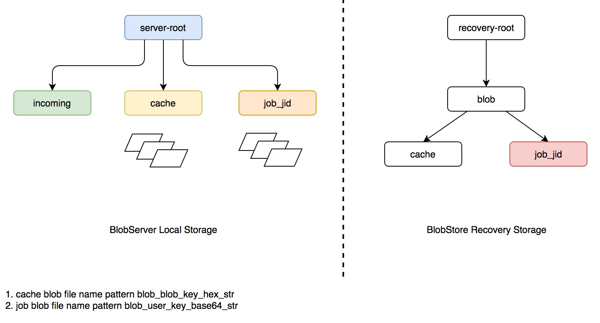
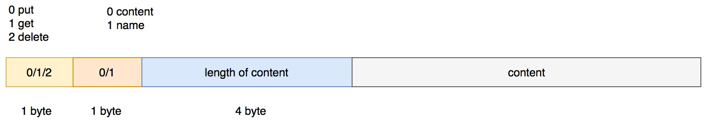
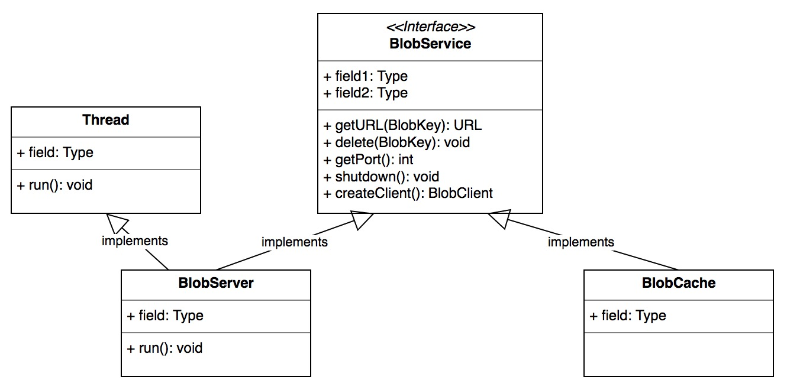
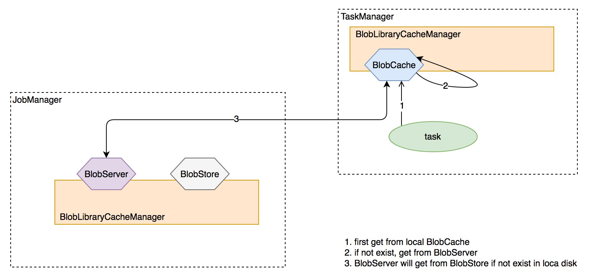
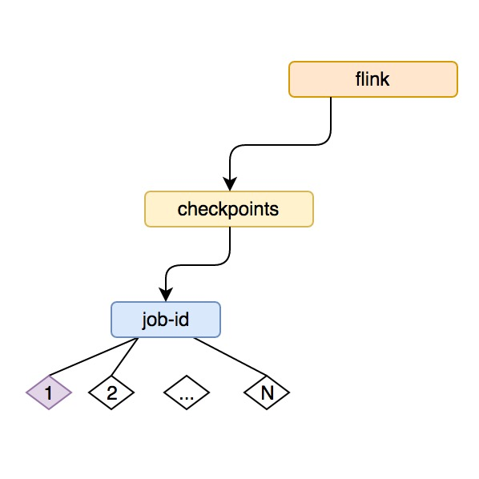

# JobManager中的基本组件

## 前言

JobManager 是 flink 集群的中控节点，类似于 Apache Storm 的 Nimbus 以及 Apache Spark 的 Driver 的角色，它负责作业的调度、jar 包管理、checkpoint 的协调和发起等，为了后续章节的开展，本文将介绍 flink JobManager 中所部署的一些服务。


## BolbServer

flink 用来管理二进制大文件的服务，flink JobManager 中启动的 BLOB Server 负责监听请求并派发线程去处理。更进一步，它将负责创建对应的目录结构去存储这些 BLOBs 或者只是临时性地缓存。背后支持的文件系统：本底磁盘

来看它的构造器：

- 第一步获取 RecoveryMode，一共两种 STANDALONE 和 ZOOKEEPER，后者是有 JobManager leader 选举的高可用模式
- 获取文件系统存储的根目录，可配置，默认是从系统环境变量 `System.getProperty("java.io.tmpdir")` 中获取，其实就是本次磁盘存储
- 初始化 *恢复存储* 模块 BolbStore，STANDALONE 模式下为 VoidBlobStore，VoidBlobStore 是一个空实现；不会有任何持久化操作；ZOOKEEPER 模式下为 FileSystemBlobStore，FileSystemBlobStore 内部封装了磁盘文件的管理，包括添加、删除、拷贝等，BlogStore 会备份 BlobServer 的本地存储，主要用于恢复模式下的作业磁盘状态恢复用
- 启动 ServerSocket
- 启动 BlobServer 服务线程

### BlogServer 和 BlobStore

BlobStore 是 BlobServer 的组件之一，BolbStore 主要负责 BlobServer 本地存储的恢复【JobManager 重启】，这里只介绍 FileSystemBlobStore，FileSystemBlobStore 依据配置的不同支持两种文件系统存储：HDFS 和 本地文件系统

BlobServer 和  FileSystemBlobStore 的存储目录结构如下图所示：



*下面以一次客户端连接请求的发起介绍两者的协同*

来看 BolbServer 的核心 `run` 方法:

```java
//BlobServer line230
public void run() {
   try {
      while (!this.shutdownRequested.get()) {
         BlobServerConnection conn = new BlobServerConnection(serverSocket.accept(), this);
         try {
            synchronized (activeConnections) {
               while (activeConnections.size() >= maxConnections) {
                  activeConnections.wait(2000);
               }
               activeConnections.add(conn);
            }

            conn.start();
            conn = null;
         }
         finally {
            if (conn != null) {
               conn.close();
               synchronized (activeConnections) {
                  activeConnections.remove(conn);
               }
            }
         }
      }
   }
```

简要概括下逻辑：

- 当服务端收到一次存储的 request 时，会首先封装成对象 BlobServerConnection，并执行其 `start()` 方法
- BlobServerConnection 本身也是一个 Thread，封装了具体的存储逻辑
- 会接收 3 种客户端请求：PUT/GET/DELETE，具体见：

```java
//BlobServerConnection line111
switch (operation) {
case PUT_OPERATION:
   put(inputStream, outputStream, buffer);
   break;
case GET_OPERATION:
   get(inputStream, outputStream, buffer);
   break;
case DELETE_OPERATION:
   delete(inputStream, outputStream, buffer);
   break;
default:
   throw new IOException("Unknown operation " + operation);
}
```

*这里重点介绍下 PUT 操作*

- 获取本次存储操作是否带 JobID
- 在 BlobServer 的本地 incoming 文件夹中生成临时文件：temp-[auto increment integer]
- 读取将要存储的字节长度
- 读取该长度字节存储到临时文件 temp-[auto increment integer]
- 如果带 JobID，会将临时文件移动到 JobID 对应的存储目录，并将该存储文件在 BlobStore 的对应 JobID恢复目录中备份，写 OK 消息到 Socket Client 端，最终生成的路径和文件： job-id/blob_[base64 encode key]
- 如果不带 JobID，则依据传递的消息字节数组生成一个 key：BlogKey，并存储在 cache 文件夹下，同时在 BlobStore 的 cache 文件夹下做备份，将 OK 消息和 BlobKey 写回 Socket Client，最终生成的路径和文件：cache/blob_[unique hex string]

### BlobServer 交互协议

与 BlobServer 通信的消息协议包括四段：操作类型【PUT/GET/DELETE】、存储类型【是否带 JobID】、内容长度、内容，如下图所示：



*到这里 BlobServer 就介绍完了*

## InstanceManager

flink 用来追踪当前存活的 TaskManager 的管理组件，实现比较简单，这里只简单罗列下其功能：

- book 下载 JobManager 中注册的所有 TaskManager
- 负责更新从 TaskManager 中上报的心跳及 metrics 信息
- 通知 InstanceListener TaskManager 的增加与死亡


## BlobLibraryCacheManager

flink job 的 jar 包存储服务，使用上面的 BlobServer 完成，一个 JVM 里只会存在一个 BlobLibraryCacheManager，BlobLibraryCacheManager 负责管理 BlobService【这里为BlobServer】 中存储的 jars，并存储运行时 task 对 BlobService 中 jars 的引用计数，会清理不被使用任何 task 使用的 jars。

*BlobCache 负责 jars 的下载，介绍 TaskManager 的时候会详细介绍*

BlobLibraryCacheManager 与 BlobService 交互，而 BlobService 负责具体的文件管理，其具体实现有两个：BlobServer 和 BlobCache，具体见下图：



BlobServer 前面已经介绍过了，那么 BlobCache 的功能是什么呢？

来看 BlobCache 的构造器：

```java
//BlobCache line60
public BlobCache(InetSocketAddress serverAddress, Configuration configuration) {
   if (serverAddress == null || configuration == null) {
      throw new NullPointerException();
   }

   this.serverAddress = serverAddress;

   // configure and create the storage directory
   String storageDirectory = configuration.getString(ConfigConstants.BLOB_STORAGE_DIRECTORY_KEY, null);
   this.storageDir = BlobUtils.initStorageDirectory(storageDirectory);
   LOG.info("Created BLOB cache storage directory " + storageDir);
```

这里传入的 serverAddress 其实是 BlobServer 的服务端口，在 TaskManager 中可以看到：

```java
// start a blob service, if a blob server is specified TaskManager line940
if (blobPort > 0) {
  val jmHost = jobManager.path.address.host.getOrElse("localhost")
  val address = new InetSocketAddress(jmHost, blobPort)

  log.info(s"Determined BLOB server address to be $address. Starting BLOB cache.")

  try {
    val blobcache = new BlobCache(address, config.configuration)
    blobService = Option(blobcache)
    libraryCacheManager = Some(new BlobLibraryCacheManager(blobcache, config.cleanupInterval))
  }
```

来看 BlobCache 的核心服务方法：

```java
//BlobCache line97
public URL getURL(final BlobKey requiredBlob) throws IOException {
   if (requiredBlob == null) {
      throw new IllegalArgumentException("BLOB key cannot be null.");
   }

   final File localJarFile = BlobUtils.getStorageLocation(storageDir, requiredBlob);

   if (!localJarFile.exists()) {

      final byte[] buf = new byte[BlobServerProtocol.BUFFER_SIZE];

      // loop over retries
      int attempt = 0;
      while (true) {

         if (attempt == 0) {
            LOG.info("Downloading {} from {}", requiredBlob, serverAddress);
         } else {
            LOG.info("Downloading {} from {} (retry {})", requiredBlob, serverAddress, attempt);
         }

         try {
            BlobClient bc = null;
            InputStream is = null;
            OutputStream os = null;

            try {
               bc = new BlobClient(serverAddress);
               is = bc.get(requiredBlob);
               os = new FileOutputStream(localJarFile);

               while (true) {
                  final int read = is.read(buf);
                  if (read < 0) {
                     break;
                  }
                  os.write(buf, 0, read);
               }

               // we do explicitly not use a finally block, because we want the closing
               // in the regular case to throw exceptions and cause the writing to fail.
               // But, the closing on exception should not throw further exceptions and
               // let us keep the root exception
               os.close();
               os = null;
               is.close();
               is = null;
               bc.close();
               bc = null;

               // success, we finished
               break;
```

简要概括下其逻辑：

- 先从本地磁盘中获取，如果存在，直接返回
- 如果没有，生成 BlobClient 与 BlobServer 交互，并拉取文件到本地缓存，后返回本地缓存的文件句柄

从这里我们可以看到 BlobCache 是 TaskManager 操作本地文件的工具，它负责从 JobManager 中的 BlobServer 同步所需的文件【jar包等】，而 BlobServer 和 BlobCache 的文件管理的入口，统一由对应 JVM 中的 BlobLibraryCacheManager 来控制【没有任务使用的 jar 定期清除等】。

task 拉取 jar包文件的过程如下：




## ZooKeeperCompletedCheckpointStore

flink 做 checkpoint 【有关 checkpoint 会另起一节介绍】存储的组件，负责存储已完成的 Checkpoint ，实现了接口 CompletedCheckpointStore，StandaloneCompletedCheckpointStore 和 ZooKeeperCompletedCheckpointStore 都实现了 CompletedCheckpointStore 接口，前者只在内存里存储 checkpoint，这里只介绍 ZooKeeperCompletedCheckpointStore 的实现。

ZooKeeperCompletedCheckpointStore 存储 checkpoint 的基本思路：

- 先在本地磁盘持久化指定数量的 checkpoint
- 将文件句柄更新到 ZK 的特定节点下
- 滑动更新 zk 的节点存储
- 在恢复的时候只取最近一次的更新值

先来看下  ZooKeeperCompletedCheckpointStore 用来和 ZK 存储交互的组件：ZooKeeperStateHandleStore，来看它的核心添加 state 的方法：

```java
//ZooKeeperStateHandleStore line117
public StateHandle<T> add(
      String pathInZooKeeper,
      T state,
      CreateMode createMode) throws Exception {
   checkNotNull(pathInZooKeeper, "Path in ZooKeeper");
   checkNotNull(state, "State");

   StateHandle<T> stateHandle = storage.store(state);

   boolean success = false;

   try {
      // Serialize the state handle. This writes the state to the backend.
      byte[] serializedStateHandle = InstantiationUtil.serializeObject(stateHandle);

      // Write state handle (not the actual state) to ZooKeeper. This is expected to be
      // smaller than the state itself. This level of indirection makes sure that data in
      // ZooKeeper is small, because ZooKeeper is designed for data in the KB range, but
      // the state can be larger.
      client.create().withMode(createMode).forPath(pathInZooKeeper, serializedStateHandle);

      success = true;

      return stateHandle;
   }
   finally {
      if (!success) {
         // Cleanup the state handle if it was not written to ZooKeeper.
         if (stateHandle != null) {
            stateHandle.discardState();
         }
      }
   }
}
```

简要概括其逻辑：

- 使用 StateStorageHelper 存储 state，ZK 模式下为 FileSystemStateStorageHelper，方式为直接存储到本地磁盘
- 将 state 的句柄对象 StateHandle 序列化并持久化到 ZK 的节点

其在 zk 上的存储路径如下图所示：



现在来看 ZooKeeperCompletedCheckpointStore 的核心功能：添加 checkpoint 和 从 checkpoint 做 recovery

### 添加 checkpoint

```java
//ZooKeeperCompletedCheckpointStore line190
public void addCheckpoint(CompletedCheckpoint checkpoint) throws Exception {
   checkNotNull(checkpoint, "Checkpoint");

   // First add the new one. If it fails, we don't want to loose existing data.
   String path = String.format("/%s", checkpoint.getCheckpointID());

   final StateHandle<CompletedCheckpoint> stateHandle = checkpointsInZooKeeper.add(path, checkpoint);

   checkpointStateHandles.addLast(new Tuple2<>(stateHandle, path));

   // Everything worked, let's remove a previous checkpoint if necessary.
   if (checkpointStateHandles.size() > maxNumberOfCheckpointsToRetain) {
      removeFromZooKeeperAndDiscardCheckpoint(checkpointStateHandles.removeFirst());
   }

   LOG.debug("Added {} to {}.", checkpoint, path);
}
```

简要概括其逻辑：

- 在本地磁盘存储该 checkpoint 的内容并返回句柄对象：StateHandle
- 以 checkpoint id 在 zk 上新建一个 node，并存储对应的序列化后的 StateHandle
- 检查存储的 checkpoint 个数是否超过限制，如果超过，删除本地磁盘及zk上最旧的数据
- 如果添加失败，已有的 checkpoint 数据不会受影响，这里 flink 想最大化保留作业的 checkpoint

### 从 checkpoint 中恢复

```java
//ZooKeeperCompletedCheckpointStore line137
public void recover() throws Exception {
   LOG.info("Recovering checkpoints from ZooKeeper.");

   // Clear local handles in order to prevent duplicates on
   // recovery. The local handles should reflect the state
   // of ZooKeeper.
   checkpointStateHandles.clear();

   // Get all there is first
   List<Tuple2<StateHandle<CompletedCheckpoint>, String>> initialCheckpoints;
   while (true) {
      try {
         initialCheckpoints = checkpointsInZooKeeper.getAllSortedByName();
         break;
      }
      catch (ConcurrentModificationException e) {
         LOG.warn("Concurrent modification while reading from ZooKeeper. Retrying.");
      }
   }

   int numberOfInitialCheckpoints = initialCheckpoints.size();

   LOG.info("Found {} checkpoints in ZooKeeper.", numberOfInitialCheckpoints);

   if (numberOfInitialCheckpoints > 0) {
      // Take the last one. This is the latest checkpoints, because path names are strictly
      // increasing (checkpoint ID).
      Tuple2<StateHandle<CompletedCheckpoint>, String> latest = initialCheckpoints
            .get(numberOfInitialCheckpoints - 1);

      CompletedCheckpoint latestCheckpoint = latest.f0.getState(userClassLoader);

      checkpointStateHandles.add(latest);

      LOG.info("Initialized with {}. Removing all older checkpoints.", latestCheckpoint);

      for (int i = 0; i < numberOfInitialCheckpoints - 1; i++) {
         try {
            removeFromZooKeeperAndDiscardCheckpoint(initialCheckpoints.get(i));
         }
         catch (Exception e) {
            LOG.error("Failed to discard checkpoint", e);
         }
      }
   }
}
```

简要概括其逻辑：

- 清除内存中维护的句柄对象 StateHandle s
- 从 ZK 上拉取作业对应的所有的 checkpoint StateHandle 节点，并排序【从小到大】
- 获取最新的一次快照并从本地磁盘恢复 checkpoint
- 删除其余所有的 checkpoint 信息【ZK 和本地磁盘】

ZooKeeperCompletedCheckpointStore 由 ZooKeeperCheckpointRecoveryFactory 负责实例化，一个 Job 会实例化一个 ZooKeeperCompletedCheckpointStore 负责快照。这里存储的只是个节点快照的句柄，并不是真正的状态数据。

具体的启动流程见 JobManager

`line1208 val completedCheckpoints = checkpointRecoveryFactory.createCheckpointStore(jobId, userCodeLoader)` 

`line1238 executionGraph.enableSnapshotCheckpointing`

到这里 JobManager 的核心组件基本就介绍结束了😄