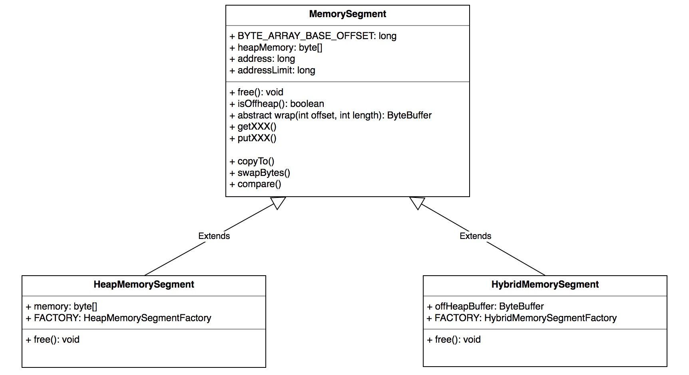
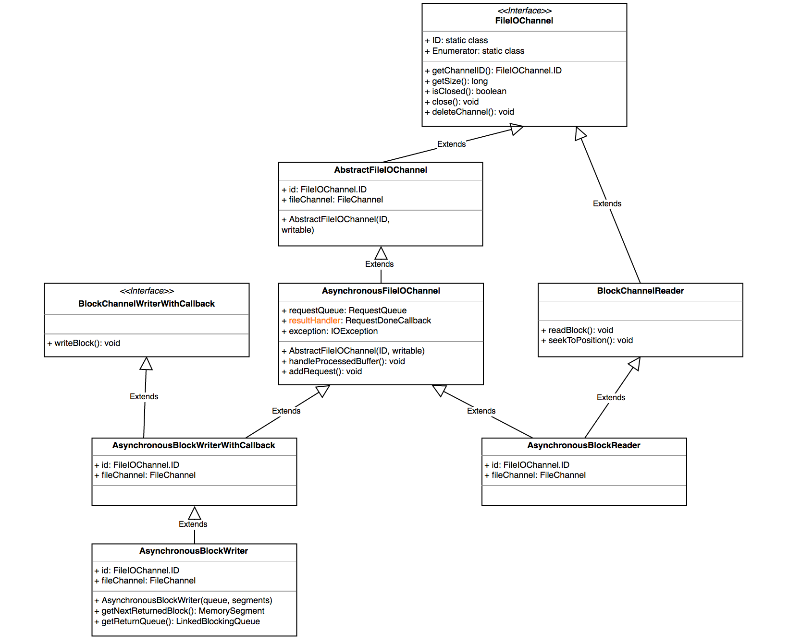
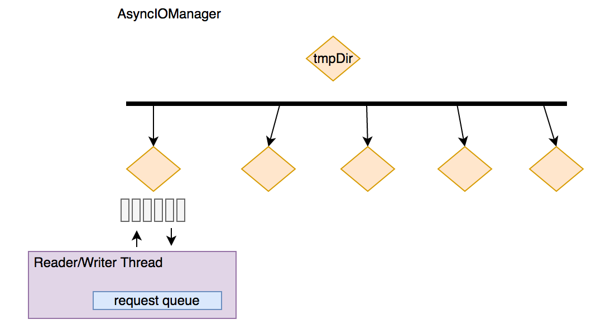

# TaskManager基本组件

TaskManager 在 Flink 中也被叫做一个 Instance，统一管理该物理节点上的所有 Flink job 的 task 的运行，它的功能包括了 task 的启动销毁、内存管理、磁盘IO、网络传输管理等，本章将一一介绍这些功能，方面后续章节的开展

## MemoryManager

*先来翻译一下类的 JavaDoc ^_^*

MemoryManager 统一管理了 flink 的内存使用，内存被划分为相同大小的 segment，通过申请不同数量的 segment 来分配不同大小的内存

这里支持两种内存：on-heap 内存和 off-heap 内存，通过参数可以控制分配内存的种类

MemoryManager 管理内存也分两种模式：预分配和按需分配。预分配模式下，内存在启动时就会分好，这就会意味着不会发生 OOM 异常，释放的内存会重新归还 MemoryManager 的内存池；按需模式下，MemoryManager 仅仅追踪内存的使用【做记录】，释放内存不会归还 MemoryManager 的内存池，而是通过托管给 JVM 的垃圾回收来最终释放，这样便可能会发生 OOM

*下面我们就来分析下 MemoryManager 的实现细节*

### MemorySegment

上面已经提到，MemoryManager 以 segment 为单位来实现内存的分配和管理，在 flink 中一个 segment 被抽象为 MemorySegment，MemorySegment 为抽象类，定义了基本的 put/get 方法，以及 swap、compare 等工具方法，同时维护了一个偏移量：BYTE_ARRAY_BASE_OFFSET，这个偏移量为 byte[] 对象在内存中的基本偏移量，后续通过 `sun.misc.Unsafe` 直接操纵内存就是基于这个偏移量来完成，这个类定义的实现方法屏蔽了内存的种类【堆和非堆】，当其成员变量 heapMemory 不为空时就是堆内存，此时的 address 就是 BYTE_ARRAY_BASE_OFFSET；而 heapMemory 为 null 时代表非堆内存，此时的 address 是内存中的绝对地址。

MemorySegment 有两个实现类：HeapMemorySegment 和 HibridMemorySegment，分别代表堆内存 segment 和 非堆内存 segment，具体的继承关系如下：



HeapMemorySegment 和 HibridMemorySegment 中都分别定义了工厂类来实例化对象实例。

### MemoryPool

MemoryPool 是 MemoryManager 用来统一管理资源的组件，具体又分为 HeapMemoryPool 和 HybridOffHeapMemoryPool，前者管理堆内存，后者管理非堆内存。

*先来看HeapMemoryPool*

```java
//MemoryManager.java line 616
@Override
		HeapMemorySegment allocateNewSegment(Object owner) {
			return HeapMemorySegment.FACTORY.allocateUnpooledSegment(segmentSize, owner);
		}

		@Override
		HeapMemorySegment requestSegmentFromPool(Object owner) {
			byte[] buf = availableMemory.remove();
			return  HeapMemorySegment.FACTORY.wrapPooledHeapMemory(buf, owner);
		}

		@Override
		void returnSegmentToPool(MemorySegment segment) {
			if (segment.getClass() == HeapMemorySegment.class) {
				HeapMemorySegment heapSegment = (HeapMemorySegment) segment;
				availableMemory.add(heapSegment.getArray());
				heapSegment.free();
			}
			else {
				throw new IllegalArgumentException("Memory segment is not a " + HeapMemorySegment.class.getSimpleName());
			}
		}
```

简单总结：

- allocateNewSegment 走的是 on demand 模式，通过 new byte[] 从堆上分配内存
- requestSegmentFromPool 走的是 pre allocate 模式，通过复用已有的堆对象

HybridOffHeapMemoryPool 的接口与其类似，不过分配内存走的是 `ByteBuffer.allocateDirect(segmentSize);` 直接分配了物理内存，也就是非堆内存

## IOManager

flink 通过 IOManager 来控制磁盘 IO 的过程，提供同步和异步两种写模式【其实只有异步】，具体的读写方式又分为 block、buffer、bulk 三种方式；用户可以指定 IO 的文件目录集合，IOManager 会以 round-robin 的方式写不同目录的不同文件。

IOManager 提供两种方式枚举新的 IO 文件：

- 直接 round-robin 文件夹并生成文件，每个新文件的命名 pattern 为 random_hex_string.channel，最终对应的目录结构是：

  path1/random_hex_string1.channel

  path2/random_hex_string2.channel

  path3/random_hex_string3.channel

- 采取 Enumerator 的模式，每个 Enumerator 也是类似如上一种方式进行 round-robin，不过 Enumerator 会维护一个固定的本地命名前缀、一个本地计数器、一个全局计数器，命名前缀用于区分不同的 Enumerator 写的文件，本地计数器用于 Enumerator 自身的文件命名递增，全局计数器用于 round-robin 文件夹，最终的目录结构是：

  path1/prefix.local_counter1.channel

  path2/prefix.local_counter2.channel

  path3/prefix.local_counter3.channel

flink 又进一步将一个文件的 IO 抽象成了 FileIOChannel，通过 FileIOChannel 封装了底层的文件读写，具体的继承关系如下：



IOManager 的唯一实现类：IOManagerAsync 为每个人临时文件加【用户初始化的时候指定】维护了一个读线程和写线程，并且每个读写线程内部会维护一个请求队列: RequestQueue，上面的 FileIOChannel 通过将 读写请求加入到对应的 RequestQueue 中来实现文件读写，具体的线程模型如下：



ps: 默认的临时文件夹目录是 java.io.tmpDir

## NetworkEnvironment

NetworkEnvironment 是每个 Instance 的网络 IO 组件，包含了追踪中间结果和数据交换的数据结构。它的构造器会统一将配置的内存先分配出来，抽象成 NetworkBufferPool 统一管理内存的申请和释放。

### BufferPool

从 MemoryManager 的介绍中我们讲到 flink 是以 MemorySegment 为单位来管理内存的，而一个 MemorySegment 又被叫做一个 Buffer。BufferPool 是管理 Buffer 的工具。Buffer 的申请统一交给 NetworkBufferPool，具体的管理交给 LocalBufferPool。

#### LocalBufferPool

我们来看 LocalBufferPool 的关键接口，以了解具体都有哪些方式来管理 Buffer 😄。

##### 申请 Buffer

```java
//LocalBufferPool line136
private Buffer requestBuffer(boolean isBlocking) throws InterruptedException, IOException {
		synchronized (availableMemorySegments) {
			returnExcessMemorySegments();

			boolean askToRecycle = owner != null;
//...
```

总结其逻辑：

- 申请 Buffer
- 释放超量申请的 Buffer
- 像 NetworkBufferPool 申请 Buffer
- 如果此 LocalBufferPool 有 owner【ResultPartition】，像 ResultPartition 释放内存，这里又会下发到 ResultPartition 的 subPartition，释放是以 subPartition 的全部内存为单位，会将内存中的数据吐到磁盘上或者不释放【依据配置的不同】

##### 回收 Buffer

```java
//LocalBufferPool line175 
public void recycle(MemorySegment segment) {
		synchronized (availableMemorySegments) {
			if (isDestroyed || numberOfRequestedMemorySegments > currentPoolSize) {
				returnMemorySegment(segment);
			}
```

简单的总结：

- 如果此 LocalBuffer 已销毁或超量使用，将 Buffer 归还给 NetworkBufferPool
- 否则如果注册了 EventListener ，通知每个 listener 这个 Buffer 被回收
- 如果没有注册，将这个 Buffer 重新标记为可使用【加入到待申请队列】

##### 调整 Buffer 大小

```java
//LocalBufferPool line237
public void setNumBuffers(int numBuffers) throws IOException {
		synchronized (availableMemorySegments) {
			checkArgument(numBuffers >= numberOfRequiredMemorySegments, "Buffer pool needs at least " + numberOfRequiredMemorySegments + " buffers, but tried to set to " + numBuffers + ".");

			currentPoolSize = numBuffers;
```

简单总结：

- 归还超量使用的内存给 NetworkBufferPool
- 如果还是超量使用，调用 owner 的释放接口【以 ResultSubPartiton 为单位释放】

#### NetworkBufferPool

上面已经提到，NetworkbufferPool 统一管理了网络栈的内存，LocalBufferPool 只是管理 Buffer 的方式，具体的申请和释放还是要走 NetworkBufferPool 的接口。值得注意的是，NetworkBufferPool 在实例化的时候就将初始的固定大小的内存分配出来了【不管是堆还是非堆】。我们来看它的关键接口：

##### 创建 LocalBufferPool

```java
//NetworkBufferPool line184
@Override
	public BufferPool createBufferPool(int numRequiredBuffers, boolean isFixedSize) throws IOException {
		// It is necessary to use a separate lock from the one used for buffer
		// requests to ensure deadlock freedom for failure cases.
		synchronized (factoryLock) {
			if (isDestroyed) {
				throw new IllegalStateException("Network buffer pool has already been destroyed.");
			}
```

简单总结：

- 做一些状态备份，包括整体使用的 Buffer 数、可动态调整大小的 BufferPool 等
- 对于可动态调整的 BufferPool，重新调整可用内存，调整方式为 round-robin

##### 销毁 LocalBufferPool

```java
//NetworkBufferPool line227
@Override
	public void destroyBufferPool(BufferPool bufferPool) {
		if (!(bufferPool instanceof LocalBufferPool)) {
			throw new IllegalArgumentException("bufferPool is no LocalBufferPool");
		}
```


简单总结：

- 消除状态记录
- 对于可动态调整的 BufferPool，重新调整可用内存，调整方式为 round-robin

